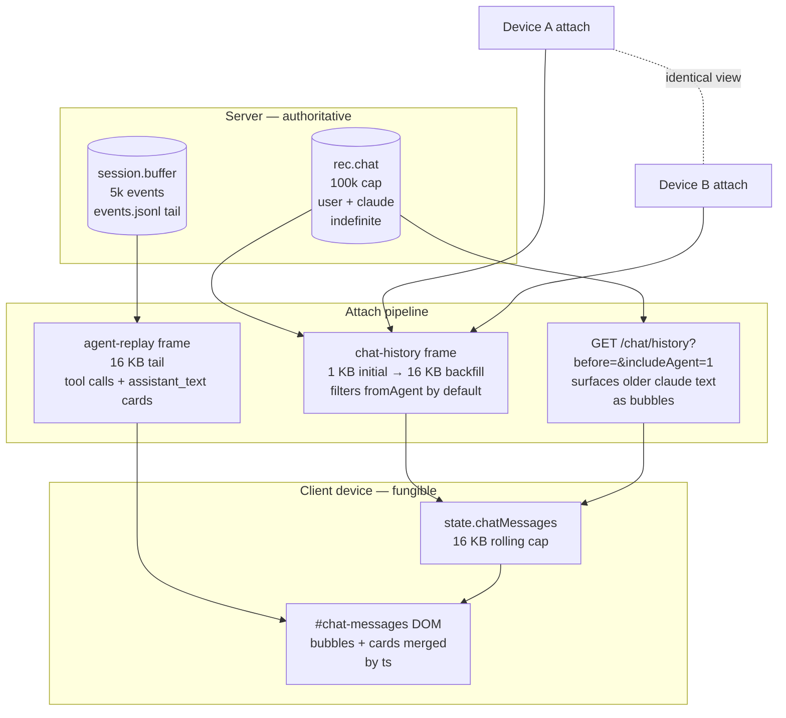

# Mycelium — Claude Code Instructions

## Working in this repo

1. **Always prefer existing scripts over ad-hoc commands.** Before composing a one-off shell sequence, look for a script that already does the job (`./test/test.sh`, `./test/test-browser.sh`, `./scripts/deploy.sh`, `./scripts/install-tls.sh`, etc.). If one exists, run it. If one almost exists, extend it rather than copy-pasting its logic into a new chat-only command. This keeps behaviour reproducible and the CI/dev paths in sync.

2. **Delegate long-running tasks to a subagent.** Deploys, Docker builds, multi-step SSH sequences, and large refactors that span many files belong in a subagent (via the Agent tool), not the main conversation loop. Brief the subagent fully — paths, the relevant commit SHA, constraints, what *not* to touch — and ask for a short report back. Quick one-shot edits, single greps, and small reads stay in the main loop.

3. **Task-list etiquette — `/task`, `/skip`, `/cancel`, and stale-task reminders.** The user can intervene in your internal TaskList from the chat pane via three slash commands. The server (see `server/src/slashcmds.js handleTaskList` + `handleTaskSkip`) forwards them to your running session as a natural-language directive:

   - **`/task`** → the server sends *"Please list your current pending and in-progress internal tasks (TaskList). Format as a short numbered list with id + subject."* — reply with every `pending` and `in_progress` task with id + subject, max ~15 lines. Don't dump completed/deleted tasks — they're noise.
   - **`/skip <id>`** or **`/cancel <id>`** → the server sends *"Please dismiss internal task #N via TaskUpdate({ taskId, status: 'deleted' })…"* — run that update and reply with one line confirming the dismissal (`✓ task #N dismissed — <subject>`). If the id is unknown, say so and offer to run `/task` first.
   - **Stale-task heads-up — proactively volunteer.** Every time the user message looks like a continuation of an existing thread, scan the task list reminders for entries that have been `pending` for what looks like a long time (e.g., spans more than one user-message worth of work and isn't on your immediate critical path, or is explicitly user-owned like "user will handle"). If you see one, prepend a one-line `📌 Heads up: task #N still <pending|in_progress> — <subject>. Use \`/skip N\` to dismiss or \`/cancel N\` to drop.` to your reply. Keep it to one line — don't lecture, just remind. Skip the reminder when there's nothing stale or when you've already mentioned the same id in the immediate prior reply (no double-nag).
   - **When YOU mark a task completed**, you don't need the `📌 Heads up` line — that's only for the tasks the user can act on.

## Session storage

1. **Session folder = session id.** Every new session spawned via the
   spawn modal lives at `WORKSPACE/<user>/<session-id>/` (e.g.
   `/wks/kkrazy/myco-kkrazy-6bd8b83e/`). The spawn-modal text input is
   an optional friendly *display label*, not a path. Predictable,
   collision-proof. Existing sessions with arbitrary `rec.cwd` values
   (e.g. `test006`, `myco`) keep working — only NEW spawns use the
   id-as-folder rule.

2. **All session-scoped state lives under `WORKSPACE/<user>/<session-id>/`.**
   - `_myco_/` — extracted artifacts (`plan.json`, `arch.md`, `test.md`,
     `README`). Checked into the project's git so the plan + arch +
     test sheet move with the code.
   - `.claude/memory/` — the SDK's auto-memory directory for this
     session (set via `settings.autoMemoryDirectory` on every
     `query()` call in `server/src/agent-session.js`). Replaces the
     SDK default `$HOME/.claude/projects/<sanitized-cwd>/memory/`,
     which would otherwise pool every session's memory into the
     shared container `/root/.claude/`.
   - `.claude/settings.json` + `.claude/settings.local.json` — per-
     project SDK settings (permissions, allow-list rules persisted by
     the SDK's "Allow always" picks, etc.). Loaded via
     `settingSources: ['project', 'local']`; the shared `'user'` tier
     (`$HOME/.claude/settings.json`) is deliberately excluded so
     sessions don't bleed config across each other.
   - `CLAUDE.md` — project-level instructions for the SDK conversation
     (templated from the myco best-practices block on first spawn).
   - Anything else claude writes (Bash output to relative paths,
     Edit/Write tool destinations) lands here too because
     `options.cwd` points at this folder.

3. **What still lives at the container level (NOT per-session):**
   - `/data/sessions.json` — the session registry (id, label, cwd,
     mode, allow/deny lists, chat history). Cross-session shared.
   - `/data/auth-sessions.json` + `/data/git-tokens.json` — auth state,
     shared across all sessions for a user. (`gh-tokens.json` was the
     pre-td-4 flat per-user GitHub-only file — `git-tokens.js` reads it
     once on first load and migrates it into `git-tokens.json` under
     the user-level `github` slot.)
   - `/root/.claude/.credentials.json` — SDK auth, shared. (Per-user,
     not per-session.)

## Pre-Commit

1. **ALWAYS run the FULL `./test/test.sh` before committing — not cherry-picked adjacent tests.** Running 5–10 "obviously affected" suites individually is NOT a substitute. The full script catches static-check drift (e.g. an old `test.sh` block pinning a shape your refactor changed) that per-file `node test/foo.test.js` runs will MISS. Fix every failure (or confirm it's purely environmental, like missing `docker` on the agent sandbox) before proceeding. If `./test/test.sh` aborts early on the host (busybox grep, missing python3, etc.), fix the host OR the script first — don't skip the suite.

2. **Every new feature must come with a test.** When you add a behaviour to `server/`, `web/public/`, the Dockerfile, or any deploy/runtime path, also add a check to `./test/test.sh` that would have caught the bug if the feature regressed. Static-only behaviour can usually be a `grep` or a `node -e` check; runtime behaviour belongs in the persistence/server-smoke section that runs the real container. Aim for the smallest test that fails meaningfully if the feature breaks. Bug fixes also count as features — write the regression test before (or alongside) the fix so it red-green-flips.

3. **After every merge, run the FULL `./test/test.sh` before push.** A clean auto-merge (`ort` strategy resolves with no conflict) is NOT a green light to push — the merged tree can still trip static-grep guards, static checks, or persistence-phase assertions that touched files from BOTH branches. The risk surface is exactly the union of the two branches' files. Same discipline as Pre-Commit §1 — run the full suite, fix every failure (or confirm environmental), and only then push the merge commit. Cherry-picked "obviously affected" tests are NOT a substitute even after a clean merge.

## Deployment

0. **NEVER deploy unless the user explicitly asks for it — `myco.labxnow.ai` is the production target. `opti.labxnow.ai` is RETIRED — do not deploy there ever again.** As of 2026-05-27 the production deploy target is **`myco.labxnow.ai`** (formerly opti, switched on user instruction). `opti.labxnow.ai` is decommissioned for deploys; the recipes below remain only as historical reference. Push-and-deploy is also not an implicit part of any task — landing code on `main` is finishing the task. Do not run `./scripts/deploy.sh`, do not scp the source archive to a host, do not SSH into any deploy host to swap the container, do not propose deploying as the next step. Wait for the user to say "deploy" (or "ship", "release", "push to prod", etc.) before running any deploy command. The same explicit-ask rule applies to `mycobeta.labxnow.ai`. The recipes in §1 + §2 below describe HOW to deploy — they do not authorize WHEN, and any reference to opti in them is dead weight pending §1's rewrite.

1. **Always deploy via `./scripts/deploy.sh`.** It builds the Docker image locally, streams it over SSH to `myco.labxnow.ai`, and swaps the container against a single bind-mounted state directory. Do not push raw source or `systemctl restart` on the remote.

2. **Deploying to `mycobeta.labxnow.ai`: do it on the host itself.** Local Docker is often unavailable, so the working recipe (verified 2026-05-11) is: `git archive HEAD -o /tmp/myco-src.tgz`, `scp` it to `kkrazy@mycobeta.labxnow.ai:/tmp/`, extract into `~/myco-src` (overwriting), then `ssh kkrazy@mycobeta.labxnow.ai 'cd ~/myco-src && MYCO_DEPLOY_HOST=kkrazy@localhost ./scripts/deploy.sh'`. The script SSHes back to localhost on mycobeta and runs the normal build/swap there. ssh-to-self on mycobeta is already set up.

3. **Single-state-dir layout** (the deploy.sh contract):
   - One host directory holds *all* persistent state. Default: `MYCO_STATE_DIR=/home/kkrazy/myco-state` (override with the env var).
   - Container bind-mounts:
     ```
     $MYCO_STATE_DIR        → /data    (sessions.json, .env, auth-sessions.json,
                                        allowed-github-users.txt, git-tokens.json, caddy/, …)
     $MYCO_STATE_DIR/home   → /root    (claude config: .claude/, .claude.json)
     $MYCO_STATE_DIR/wks    → /wks     (workspaces)
     $MYCO_STATE_DIR/Caddyfile → /etc/caddy/Caddyfile  (read-only)
     ```
   - No named or anonymous Docker volumes — everything is reachable from the host. Backup = tar the state dir; restore = untar and `docker run`.
   - The Caddyfile lives in the state dir too — `deploy.sh` seeds it from `/home/kkrazy/myco/Caddyfile` (remote, historical) or the project tree (local — `docker/Caddyfile`) on first deploy.

4. **Auth: GitHub OAuth + invitation allowlist.**
   - Required env in `$STATE_DIR/.env`: `MYCO_GH_CLIENT_ID`, `MYCO_GH_CLIENT_SECRET`, `MYCO_PUBLIC_ORIGIN` (e.g. `https://myco.labxnow.ai`). Set with `./scripts/deploy.sh --set-oauth <id>:<secret>`.
   - The OAuth App's callback must be `<MYCO_PUBLIC_ORIGIN>/auth/github/callback`. Scopes requested: `read:user user:email repo`.
   - `$STATE_DIR/allowed-github-users.txt` lists invited GitHub logins, one per line (`#` comments). Only listed users can complete sign-in. Add with `./scripts/deploy.sh --allow-github-user <login>` (idempotent, no container restart).
   - Minted myco session tokens live in `$STATE_DIR/auth-sessions.json` (mode 0600, 30-day sliding TTL).
   - The OAuth access token for each user is mirrored into `$STATE_DIR/git-tokens.json` (mode 0600) at the user-level `github` slot. Per-repo PATs (set via `/setpat <token>` from a session) live in the same file under `<provider>/<owner>/<repo>` keys and override the user-level fallback. Used by `/feature`/`/bug` slash commands — they auto-detect provider (github vs. gitee) from the session's `git remote get-url origin` and pick the right PAT. Gitee has no OAuth flow yet — Gitee repos require an explicit `/setpat` from the session.

5. **Override knobs:** `MYCO_DEPLOY_HOST`, `MYCO_STATE_DIR`, `MYCO_IMAGE_TAG`, `MYCO_CONTAINER`. `--skip-tests` skips `./test/test.sh`, `--dry-run` reports the plan without shipping or swapping.

## Troubleshooting

1. **`[connecting...] / [reconnecting...]` loop in the chat pane, no `/attach/` requests in `docker logs myco`** — the browser is failing the WSS handshake before it reaches the server. Verify the server is fine first by hitting it from a different network: `curl -sk -i --http1.1 -H "Connection: Upgrade" -H "Upgrade: websocket" -H "Sec-WebSocket-Version: 13" -H "Sec-WebSocket-Key: dGhlIHNhbXBsZSBub25jZQ==" "https://myco.labxnow.ai/attach/<session-id>"` should return `101 Switching Protocols` and stream output. If it does, the user's network/firewall is dropping or stripping WS upgrade traffic — common culprits: corporate firewalls/DPI, VPN clients, antivirus that proxies HTTPS, browser extensions, or a stale `alt-svc: h3=":443"` cached by the browser pointing at HTTP/3 (which doesn't support WebSocket — clear via `chrome://net-internals/#alt-svc` or test in incognito). Disabling HTTP/3 in `Caddyfile` (`servers { protocols h1 h2 }`) is the quick remediation.

2. **OAuth callback shows "Login failed: OAuth state expired or invalid"** — the user took too long (>5 min) on the GitHub authorize page, or the server restarted between `/auth/github/start` and the callback (state nonces are in-memory). Click "Sign in with GitHub" again. If the failure is reproducible immediately, check `MYCO_PUBLIC_ORIGIN` in `.env` matches the host the user is browsing — a mismatch means the redirect_uri sent to GitHub doesn't match the OAuth App registration, and GitHub will return an error parameter.

3. **OAuth callback shows "Not invited yet"** — the GitHub login isn't in `$STATE_DIR/allowed-github-users.txt`. Add with `./scripts/deploy.sh --allow-github-user <login>` and have the user retry. No container restart needed (the file is read on each login attempt).

4. **`/feature`/`/bug` reports "no GitHub token on file"** — the OAuth grant didn't include the `repo` scope (older sign-ins predating the scope addition), or the user revoked the token from GitHub Settings → Applications. Either sign out (status-bar `@username` → confirm) + back in to refresh OAuth, or run `/setpat <token>` from the session to save a per-repo PAT (also works as the manual fallback when prod's OAuth `.env` isn't configured).

5. **`/feature`/`/bug` reports "no Gitee PAT on file"** — Gitee has no OAuth flow yet, so PATs must be set manually per-repo. Generate one at https://gitee.com/profile/personal_access_tokens (scope: `issues`) and run `/setpat <token>` from a session whose `git remote get-url origin` is a `gitee.com:owner/repo` URL. The PAT is stored in `$STATE_DIR/git-tokens.json` keyed by `(myco-user, gitee/owner/repo)`.

## Code Style

1. **Break functionality into small functions with one clear responsibility.** Aim for fewer than ~80 lines per function. If a function is doing setup + work + teardown, or covers more than one concept, split it. Name each function for what it does (`build_image`, `seed_caddyfile`, `test_persist_after_restart`) — the call site should read like prose. Top-level orchestration belongs in a `main()` (or equivalent) that just sequences the named steps. This keeps diffs reviewable and makes scripts/code easy to extend without rewriting the world.

2. **SDK-driven sessions only — no PTY/TUI surface.** Phase 9 retired the PTY driver (`pty.js`, `menu-interceptor.js`, `pty-patterns.js` all deleted). All sessions run as `AgentSession` instances driven by `@anthropic-ai/claude-agent-sdk`. Permission menus, tool calls, and status come through structured SDK events (`canUseTool`, `assistant`/`tool_use`/`tool_result`/`result` message types) — never by regex-matching claude's rendered text. If you find yourself wanting to parse claude's terminal output, you're solving the problem the wrong way; the SDK has a structured event for whatever you're after. The deletion is guarded by static checks in `./test/test.sh` (the PTY files must stay deleted).

## Design Guidelines

1. **Always use Mermaid diagrams** for any architecture, flow, sequence, or state diagrams. Never use ASCII art boxes or plain-text diagrams.

## Chat persistence & cross-device consistency

The chat surface is the central conversational record of a session and MUST behave identically regardless of which device or browser tab the user attaches from. The contract has three pillars:

1. **Cross-device interaction is consistent.** The server is the only source of truth (`rec.chat` in `/data/sessions.json` + `session.buffer` + `<absCwd>/_myco_/events.jsonl`). Every attached client renders the same state. No device-local chat storage; nothing in `localStorage` shapes what's shown. When a user types on phone, every laptop attached to the same session sees the message a moment later via the live `chat` WS frame, and a fresh attach from any other device reconstructs the same view from `getChatHistory(sessionId, …)` + `_shipAgentReplay(session, …)`.

2. **All chat history is persisted indefinitely** — every user input (`appendChatMessage` from `handleChatMessage`) AND every claude reply (`_persistAssistantTextToRecChat` in `agent-session.js`, mirroring each `assistant_text` block into `rec.chat` with `meta.fromAgent:true`). The retention cap is `MAX_CHAT_MESSAGES = 100_000` per session — effectively unbounded for normal use. No row is ever dropped because of byte budgets; budgets only gate the WIRE-FRAME shipped on attach, never the on-disk record. Claude's text history is the same first-class citizen as human chat; it survives container restarts, 5-min reaper kills, deploys, and `events.jsonl` rotations.

3. **The chat window client only shows a portion of the history to save client-side memory.** The client maintains a rolling `state.chatMessages` capped at `MAX_CHAT_BYTES = 16 KB` (`web/public/app.js _capChatMessagesBytes`). Initial attach ships ~1 KB of chat-history + ~16 KB of agent-replay so the first paint is sub-100ms. When the user scrolls up, the load-older button fires `GET /sessions/:id/chat/history?before=<oldestTs>&limit=<N>&includeAgent=1` — `includeAgent=1` surfaces the persisted `meta.fromAgent:true` rows that the default WS frame filters out (to avoid duplicate-render against agent-replay cards while session.buffer is fresh). Prepending older rows + re-capping evicts the youngest end from memory so the cap holds.

4. **Chronological order of user input + claude reply is always preserved.** Every row carries an ISO `ts` AND a server-allocated monotonic `meta.seq` (per-session counter). The pane renders in strict tail-ascending order regardless of which channel delivered the row. Persistence: `getChatHistory` always returns oldest→newest within a window; `appendChatMessage` writes in arrival order and auto-stamps `meta.seq` via `allocSeq`; the chat-history WS frame ships in order. Reload: when chat-history bubbles and agent-replay cards arrive back-to-back, `_resortChatPaneByTs` (`web/public/app.js`) re-sorts the DOM by `data-seq` (primary) / `data-ts` (fallback) so a slight arrival skew doesn't leave the timeline corrupted. Live: the `chat` and `agent-event` WS frames are processed in arrival order on a single event loop. Any future channel that pushes into `#chat-messages` MUST call `_resortChatPaneByTs` after its append, and any future server-side helper that hands back chat rows MUST guarantee tail-ascending output AND stamp `meta.seq` via `sessions.allocSeq`.

5. **Lossless reconnect catch-up via `?afterSeq=N`.** Every device tracks `state.lastSeenSeq` — the highest server-stamped `meta.seq` it has rendered. On WS reconnect (NOT initial open), the client appends `?afterSeq=<N>` to the attach URL. The server's `_shipAgentReplay` + `_shipChatHistory` short-circuit the byte-budget tail and ship ONLY events / chat rows with `seq > N`. The agent-replay client handler skips its wipe-and-rebuild step when `msg.afterSeq` is set, so existing DOM stays intact and only the gap is appended. Catch-up is bounded by what was missed during the disconnect window, not by an arbitrary byte budget — devices that briefly drop offline (background tab, mobile network blip, ngrok stutter) come back current without re-downloading the full tail. The same `?afterSeq=N` is also exposed on `GET /chat/history?afterSeq=N&includeAgent=1` for non-WS catch-up clients.



**Regression guard:** `test/chat-persistence-contract.test.js` locks all three pillars. Touching `getChatHistory`, `appendChatMessage`, `_persistAssistantTextToRecChat`, `MAX_CHAT_MESSAGES`, or the `/chat/history` route MUST keep these tests green.

## Diagnostics

1. **Polling the local mycod with `./scripts/collect-logs.sh`.** The running myco server (mycod) is a Node process inside a Docker container (PID 1 in the `myco` container). Its stdout/stderr is captured into an in-memory rolling buffer by `server/src/logCapture.js` (CAPACITY = 5000, see `logCapture.init()` wiring in `server/src/index.js`). A bearer-gated `GET /logs?n=N` endpoint exposes that buffer over HTTP. `./scripts/collect-logs.sh` is the human/cron-runnable helper that:

   - **Polls the LOCAL mycod** at `http://127.0.0.1:$MYCO_PORT/logs?n=500`. Auth bearer is picked automatically — latest unexpired session for `$MYCO_LOG_LOGIN` (default `kkrazy`) from `$MYCO_AUTH_FILE` (default `/data/auth-sessions.json`). No shared secret in the script.
   - **Also polls mycobeta** via `ssh kkrazy@mycobeta.labxnow.ai 'docker logs myco --since=<marker> --timestamps'`. Mycobeta-specific because the `[ws-attach]` / `[diag-resume]` instrumentation only ships there. Marker tracks the last fetch so consecutive runs only pull the delta. Phase-2 failures are warnings, not fatal — local phase 1 still runs.
   - **Dedups by `ts\tlevel\tmsg`** against the per-UTC-day files under `_myco_/logs/` (`.gitignore`d). Idempotent — re-running cost is just the dedup pass.
   - Flags: `--skip-mycobeta` / `--skip-local`, `--mycobeta-since <duration>`, `--n <N>`, `--login <user>`.

2. **`/loop` cron consumer.** The diagnostic /loop tick (cadence chosen by the user, currently 10 min) calls `./scripts/collect-logs.sh` each fire, then reads the fresh `+L` / `+M` lines per source and scans for resume-bug + menu-sync + general-error markers. The loop posts a one-line `📡 [diag-loop]` summary to chat every tick — even when there's nothing notable — so a quiet system is visibly alive. Auto-fix authority is limited to trivial fixes (log noise, typos, one-line bugs); anything touching WS protocol / auth / deploy / framing waits for explicit user approval. See the loop prompt in the active `CronList` for the full filter spec.

3. **Adding new log markers.** When you instrument something for the loop to catch, give it a stable bracketed prefix (e.g. `[ws-attach]`, `[diag-resume]`, `[menu-pick]`) so the filters in step 2 can pick it out cleanly without ambiguous substring matches. Mirror the addition into the loop prompt's filter buckets so the next tick actually reports it.

## Bash command timing — agent runtime hygiene

**Goal:** keep the user from feeling "stuck" behind a long-running shell command. Track elapsed times per command, learn which ones are slow, and pre-emptively delegate the slow ones to a background subagent so the main conversation loop stays responsive.

1. **Project memory at `_myco_/bash-elapsed.json`.** A simple JSON file the agent maintains across sessions:

   ```json
   {
     "samples": [
       { "cmd": "./test.sh",         "elapsedMs": 42300, "ts": "2026-05-17T01:30:00Z" },
       { "cmd": "./scripts/deploy.sh",        "elapsedMs": 95000, "ts": "2026-05-17T01:34:11Z" },
       { "cmd": "docker build .",     "elapsedMs": 30200, "ts": "2026-05-17T02:00:00Z" }
     ],
     "knownSlowPatterns": [
       { "pattern": "^(\\./test\\.sh|\\./deploy\\.sh|docker build)", "p95Ms": 45000 }
     ]
   }
   ```

   Each Bash invocation records `{cmd-normalized, elapsedMs, ts}`. Cap at the last 200 samples (oldest dropped). The agent recomputes `p95Ms` per matched pattern from the rolling sample window.

2. **Auto-delegate above the threshold.** `SLOW_BASH_THRESHOLD_MS = 30_000` (30 s). Before invoking a Bash command, the agent checks `knownSlowPatterns` and the most-recent samples for the same command shape:
   - If the command matches a known-slow pattern OR the median of recent samples exceeds the threshold → use `Agent` (subagent) instead of `Bash`, so the main loop stays free.
   - Brief the subagent fully (command, env vars, expected runtime, what success looks like, what to do on failure).
   - Use `run_in_background: true` when the user can productively wait or pivot — the harness will notify on completion.

3. **What counts as "the same command shape."** Strip transient bits (timestamps, generated tmpfile paths, session ids) before keying. Examples:
   - `git push origin main` and `git push origin feature/x` → both key on `git push`.
   - `ssh kkrazy@mycobeta.labxnow.ai '…'` → keys on `ssh kkrazy@<host>` (don't differentiate hosts unless they have different perf profiles).
   - `docker build -t myco:latest .` → keys on `docker build`.

4. **First-time commands.** No sample → run inline if it looks cheap (`grep`, `ls`, `node -e`, single-file reads). For anything that looks long-running (`./*.sh`, `docker …`, `npm install`, multi-step pipelines), pre-emptively delegate even on the first run; the user can correct later if the heuristic was wrong.

5. **Why this matters.** Long-running shells block the main agent's responsiveness — the user can't ask a follow-up question or course-correct until the Bash returns. Subagents run in parallel and report back via notification, so the main loop stays interactive. The historical sampling is what lets the agent learn project-specific norms (e.g., `./test/test.sh` here regularly runs ~45 s — known-slow, auto-delegate).
<!-- myco-best-practices-start -->
# Best Practices

These guidelines are auto-injected at the top of the Architecture pane.
Toggle them off via the **Best practices** checkbox in the Arch tab if
they don't apply to this project.

## 1. Refactor opportunistically — high cohesion, low coupling

Every change is also a chance to simplify. Look for ways to:

- Split functions doing more than one thing.
- Pull duplicated logic into shared helpers; remove the duplicates.
- Pass dependencies in (constructor / function args), not import them
  globally — keeps modules independently testable.
- Group related state + behaviour into one module; let unrelated
  modules talk through a narrow, named interface.
- Delete code that no longer has a caller — dead branches age into
  bugs.

If you're surprised by where a change ripples, that's a coupling
signal. Don't ignore it; capture the smell in the commit message even
if you're not refactoring this pass.

## 2. Tests come with the change — runnable by a human, framework-standard

Every feature, bug fix, or refactor lands with a test that would have
caught the original problem.

- **C / C++**: GoogleTest (`gtest`). One `TEST` per behaviour;
  arrange/act/assert per block.
- **Python**: pytest. One `test_*` function per behaviour;
  fixtures for shared setup; parametrise rather than copy-paste.
- **JavaScript / Node**: framework already chosen by the project (e.g.
  the repo's existing `node test/*.test.js` pattern). Don't introduce a
  new test runner if one is in use.
- Tests must be **runnable from the command line** by a human —
  `pytest tests/`, `ctest`, `node test/foo.test.js` — without needing
  an LLM to interpret or set up.
- A single test failure prints a clear assertion message naming WHAT
  was expected vs WHAT was observed.

## 3. Generated scripts must be runnable by a human

Anything shipped as a script (build, deploy, fix-up migration, data
backfill) MUST be reproducible by a human running it from a normal
shell — no LLM in the loop at execution time.

- Plain `bash` / `sh` / `python` / `node` invocation; no chat-driven
  steps embedded.
- All inputs are CLI flags or env vars, not interactive prompts
  (unless the prompt has a non-interactive fallback).
- Errors print enough context to debug without re-running with
  extra logging.
- Idempotent where possible — re-running shouldn't break previous
  state.

## 4. Reuse existing scripts for test / build / deploy

Before writing a one-off command sequence in chat, check whether the
project already has a script for it. If it almost-exists, **extend it
in place** rather than copy-paste a chat-only variant.

Common scripts to check for:

- `./test/test.sh`, `./run-tests.sh`, `make test`, `pytest`, `cargo test`
- `./build.sh`, `make`, `npm run build`, `cargo build`
- `./scripts/deploy.sh`, `./release.sh`, `make deploy`

If you find yourself composing a multi-step shell sequence, that's a
strong signal it should become a script (or be added to an existing
one).

## 5. Project memory under `_myco_/` belongs in git — commit + push every change

The `_myco_/` directory is the **shared, team-visible memory of the
project**. Everything under it is a first-class artifact that other
collaborators (and future agent runs) depend on. Commit + push any
change you make to it the same way you'd commit code.

What lives there:

- `plan.json` — todos / feature requests / bugs (`/td`, `/fr`, `/bug`)
  with votes, comments, run-status, and per-item run-summary findings
  posted back by the agent after each `▶ Run` dispatch.
- `architecture.md` — long-form architecture notes the Arch-tab
  extractor refreshes; the canonical "why is this thing shaped this
  way" doc for the project.
- `bash-elapsed.json` — rolling history of shell-command elapsed
  times + known-slow patterns. Agents read this on session start to
  decide whether to delegate long commands to a subagent. Shared
  memory means every collaborator benefits from the runtime norms
  one of them learned.
- `README.md` — humans-only explainer of what lives in `_myco_/`
  for someone browsing the repo on GitHub.
- Future memory files the agent adds (e.g. failure-pattern catalogs,
  per-feature design notes).

**Why it matters.** Without committing `_myco_/`, every fresh clone /
new teammate starts with no project memory — they re-discover the
slow commands, re-vote on done plan items, and re-ask the same
architectural questions. With it, the team operates on shared ground
truth and onboarding is "git clone + open the Plan tab."

**Commit cadence:** commit `_myco_/` whenever you commit code that
relates to it (a plan-item closeout alongside the feature commit, an
architecture-doc update alongside the structural change). For pure
memory drift (the running session reformatted plan.json, or new
bash-elapsed samples landed), commit it as a standalone
`memory: sync` commit so the trail stays auditable. Don't let it
sit uncommitted across sessions — the next teammate's `git pull`
should be enough to give them the latest state.

**`.gitignore`:** never add `_myco_/` to `.gitignore`. The only
sub-paths that may go ignored are transient working files (e.g.
`_myco_/logs/` daily log captures, `_myco_/cache/`) — those should
have their own `.gitignore` entry inside `_myco_/`, not at the
project root.

## 6. Every user-reported problem ships with a regression test — automatically

When the user reports a bug, surprise, or "this looks wrong" — no
matter how small — add a test that would have caught the original
problem BEFORE shipping the fix. This is not optional, and it is
not a separate task the user has to ask for.

**The flow is:**

1. User reports a problem (anywhere — chat, voice memo, /bug, a
   screenshot, "hmm that's weird"). Repeat it back in your own words
   so you've understood the symptom precisely.
2. Write a test that fails the way the user's report fails. Run it
   to confirm it red-flips against the current code. If the project's
   test framework can't easily express the failure, write the
   smallest meaningful surrogate (static-grep guard, DOM-shape
   assertion, server-route smoke) — better a partial guard than no
   guard at all.
3. Implement the fix until the test goes green.
4. Wire the test into the project's runner (`./test/test.sh`,
   `pytest`, `cargo test`, …) so it runs on every future change.
5. Note the regression in the commit message: "fix: <bug>. test:
   `test/<name>` would have caught it."

**Why "automatic" instead of "when asked":**

- The user reporting a problem twice means they should never see
  it a third time. A test is the only way to make that promise.
- Reports are the single highest-signal source of "what really
  breaks in this code" — the issues users actually hit are worth
  catching, the imagined ones are not.
- Tests written from a user's words capture the user-visible
  contract, not just the implementer's mental model. They're
  durable through refactors that touch the internal shape.
- Without the rule, every user report becomes a one-shot fix; the
  same class of bug re-lands in 2 weeks under a different name.

**Scope of "problem":**

- Functional bug: "the X never shows up after Y"
- Visual / UX surprise: "this looks like it belongs in the chrome
  strip instead of the chat bubble"
- Performance regression: "saving takes 8 s now, used to be 0.5 s"
- Cross-device / cross-browser drift: "works on laptop, missing on
  phone"
- Data-loss / persistence gap: "I switched tabs and the reply
  disappeared"

All of these count. The test doesn't have to be elaborate — even a
single `grep` that asserts the fix's marker stays present is a
sufficient floor. The point is: the user's complaint must be encoded
in code so the next iteration can't quietly re-break it.

## 7. Anchor every Bash command to the session workspace directory

Every Bash invocation must run with the **session workspace directory**
as its working directory — the folder that contains this `CLAUDE.md`,
the `_myco_/` artifact mirror, and the project's checked-out source.
Concretely, that's `WORKSPACE/<user>/<session-id>/` (e.g.
`/wks/kkrazy/myco-kkrazy-6bd8b83e/`), the path the SDK sets as
`options.cwd` when launching the agent.

**Why this is a rule, not a default.** Some harnesses (and some
parallel-tool execution patterns) reset the working directory between
Bash invocations. A command that worked in turn N — `cd foo && ./test.sh`
— may resolve `foo` against a completely different parent dir in turn N+1,
silently failing or running the wrong binary. Anchoring every command
removes the foot-gun.

**Patterns that work:**

- **Absolute paths under the session wks**, the cleanest option:
  ```bash
  wc -l /wks/kkrazy/myco-kkrazy-abc/src/index.js
  cat /wks/kkrazy/myco-kkrazy-abc/_myco_/plan.json
  ```
- **`-C <dir>` flags** on tools that accept them — no cwd dependency:
  ```bash
  git   -C /wks/kkrazy/myco-kkrazy-abc status
  make  -C /wks/kkrazy/myco-kkrazy-abc test
  ```
- **`cd <session-wks> && <command>`** chained in a single Bash
  invocation. The `cd` is local to that one call, so it's safe — just
  don't expect it to persist to the next call.
- **`working_directory` parameter** if your Bash tool exposes one —
  takes precedence over inherited cwd. Use it when available.

**Patterns that break:**

- `cd foo` in one Bash call, then `ls` in the next — the second call
  may run from `/`, `/root`, or wherever the harness reset cwd to.
- Relying on shell exports / aliases across invocations.
- Relative paths without anchoring: `./test/test.sh` in a "set-and-forget"
  context can run any test.sh that happens to live in the current dir.
- Assuming `~` expands to the human user's home — in containerized
  agent runs, `~` is typically `/root` or `/home/agent`, not the
  session wks.

**How to find "the session workspace" at runtime:**

- It's the directory containing this `CLAUDE.md`.
- It's `process.cwd()` on the agent's first Bash invocation in a
  fresh session (before any `cd`).
- For parallel tool calls, capture it explicitly:
  ```bash
  pwd > /tmp/session-wks.txt   # once at start
  SESSION_WKS=$(cat /tmp/session-wks.txt) <command>   # everywhere else
  ```

**When in doubt:** run `pwd && ls` once at the start of a task, store
the absolute path, and use it as an explicit prefix on every
subsequent Bash command. The cost of an extra 60 characters per
command is trivial; the cost of running the wrong file is not.

## 8. Anti-bloat, anti-assumption discipline for AI-assisted edits

*(Adapted from the [karpathy-skills](https://github.com/forrestchang/andrej-karpathy-skills)
`CLAUDE.md` — Andrej Karpathy's January 2026 critique of how LLMs
misbehave when writing code, distilled into agent rules.)*

These rules apply BEFORE you start typing code, not after.

1. **State assumptions explicitly when the request is ambiguous.** If
   "add validation to the login form" admits more than one
   interpretation — what kinds of validation? client- or server-side?
   what error UX? — list the interpretations in your reply BEFORE you
   write a line of code, and pick the one the user confirms. Silently
   picking an interpretation is the #1 source of work the user has to
   throw away.

2. **Surface confusion; ask rather than guess.** When something is
   unclear — an API contract you can't find, two files with the same
   name, a config that contradicts the docs — say so explicitly and
   ask. Plausible-looking-but-wrong code is more expensive than a
   clarifying question.

3. **No speculative features, abstractions, or configurability.**
   Build exactly what was asked, nothing more. No flags "for later
   use", no interfaces with one implementation, no error handling for
   branches that can't fire today, no factory functions in front of a
   single concrete class. If the user needs the abstraction tomorrow,
   they'll ask tomorrow.

4. **Surgical edits — every changed line must trace to the request.**
   When you open a file to fix bug X, fix bug X. Do not also tidy
   adjacent code, normalize unrelated comments, or "improve"
   formatting that you happen to see. If you notice a smell, mention
   it in the commit message or as a follow-up note — don't ship it as
   part of the bug-fix diff. (This is the boundary on §1's "refactor
   opportunistically": refactor when the *change rationale* demands
   it, not when the file happens to be open.)

5. **Multi-step work ships with a numbered plan + per-step
   verification.** When a task has 3+ distinct steps, write them out
   as `1. … 2. … 3. …` BEFORE starting, and end each step with an
   explicit `verify:` clause naming the check that proves the step
   landed (an assertion, a test run, a curl, a `git diff --stat`).
   Strong checks let the agent iterate autonomously; vague checks
   ("make it work") force the user to babysit.

**Why these matter for myco specifically.** Sessions are long,
parallel, and partly autonomous (the `/run` mechanism dispatches work
without per-step approval). Multi-user sharing means a silently-wrong
assumption shows up not just to the requester but to every collaborator
attached to the session. These rules front-load the clarifying step so
the autonomous portion runs on a confirmed, witnessed premise.

## 9. Stage-aware critic — 3 stages, user-driven progression (td-34)

> td-34 SUPERSEDES td-33 r3's auto-iterate clause. Pre-td-34 the
> directive said claude should auto-iterate up to 2x on critic
> disagreement before pausing. Empirically that didn't deliver the
> human-in-the-loop discipline the user wanted — claude barreled
> through stages without giving the user a chance to review each
> checkpoint. td-34 replaces it with the **explicit pause-and-
> await-accept** flow (the 5-step loop below). The auto-iterate
> language is gone; the human is in the loop on every stage.

When working through a `[run:plan#X]` dispatch, claude **MUST**
structure work into three explicit stages, emit a stage-boundary
sentinel at each transition, and **PAUSE for an explicit user
accept signal before advancing to the next stage**.

**Scope.** This rule applies to plan-item dispatches (any chat
message containing `[run:plan#<id>]`, including ▶ Run button
clicks). It does NOT apply to bare conversational turns —
clarifications, /td quick captures, etc. — where the work is too
small to benefit from stage gating.

### The three stages + their done-criteria

1. **analyze** — DONE when ALL of:
   - Problem restated in your own words (so the user can witness
     you understood, not assumed).
   - Numbered plan with explicit `verify:` clause per step (matches
     §8 rule 5).
   - Assumptions listed inline, before any source edits.
   - **ZERO source-file edits yet.** Reading and grepping are fine;
     Edit/Write/MultiEdit are NOT.

2. **code** — DONE when ALL of:
   - Production source edited per the analyzed plan, no scope
     creep beyond what was listed.
   - Regression test written that would have caught the original
     problem (matches §6).
   - The new test passes locally (run it; don't just assume).

3. **verify** — DONE when ALL of:
   - Adjacent test suites still green (the suites that touch the
     files you edited).
   - New test wired into `./test/test.sh` so future runs catch
     the regression.
   - No grep-detectable regression in related code paths.

### The sentinel grammar

Emit ONE sentinel at each transition, in this exact bracketed
shape (case-insensitive, single-space inside, no extra words):

- `[stage: analyze done]`
- `[stage: code done]`
- `[stage: verify done]`

The server parser is strict by design so claude can't accidentally
trigger on prose like "I am done analyzing." Each stage fires AT
MOST ONCE per turn (extras are deduped server-side). The sentinel
can sit on its own line or mid-paragraph.

### What the server does on each sentinel

- Snapshots the current diff (only files this run actually changed,
  not pre-existing WIP).
- Fires the configured critic (Gemini by default) with a CHECKPOINT
  prompt + td-33 r2 file-context enrichment + fr-95 specialty
  fan-out (General + Test-Validity + Perf/Security on final
  critiques; general-only on intermediate).
- Broadcasts the verdict with `isIntermediate: true` so the verdict
  pane shows a `[CHECKPOINT: <stage>]` badge.
- **Transitions the per-plan-item state machine** (fr-96):
  - `[stage: X done]` sentinel → `X.awaiting_verdict`
  - critic verdict broadcast → `X.awaiting_accept`
  - Persisted to `rec.artifacts.plan.items[].meta.stageState`.
  - Broadcast via `state-update kind:'plan-item-stage'`.
- **Keeps `_activeRunItem` alive across stages** (bug-57).
- **Physically drops a 2nd sentinel while the 1st is unresolved**
  (bug-61) — if status is `awaiting_verdict` or `awaiting_accept`,
  the new sentinel is dropped + logged + the handler returns.
  Claude MUST wait for the user to signal ✓ Accept Stage /
  ⚡ Ask Claude to Fix Stage on the existing verdict before
  another sentinel can fire. This is the physical enforcement
  layer.

### User-driven progression — the 5-step loop (td-34)

Every stage runs through this loop. The user is in the loop at the
critic step — claude does NOT auto-advance, does NOT auto-iterate.

1. **stage** — work the current stage to its done-criteria above.
   Emit the corresponding `[stage: X done]` sentinel exactly once.
2. **stage critic** — the server fires the critic + broadcasts the
   verdict to the truly-modal verdict pane (bug-55 — no
   backdrop-click dismiss; the verdict can only be closed by an
   explicit button). The state machine transitions to
   `X.awaiting_accept`. Every attached device sees the same modal
   (bug-54 — cross-device sync).
3. **next stage if accepted** — the user signals accept by:
   - Clicking `✓ Accept Stage` on the intermediate verdict pane
     (bug-56), OR
   - Clicking `✓ Accept Claude` on the final verdict pane (verify
     stage only — this also runs `/run/done` and advances the
     queue), OR
   - Replying with any accept-class phrase in chat: `accept`,
     `accepted`, `yes`, `looks good`, `proceed`, `ship it`, `✓`,
     or simply naming the next stage (`code stage`, `verify`).

   When the accept signal is received, claude advances to the next
   stage immediately — NO additional `continue` / `proceed` keyword
   needed beyond the accept signal itself.

   **How accept reaches claude (bug-68 mechanism).** Pre-bug-68 the
   accept signal transitioned `stageState` server-side but never
   actually dispatched anything to claude — the protocol document
   above was aspirational, and claude sat idle awaiting input that
   never arrived. As of bug-68, both accept paths (button click and
   chat-accept phrase) call `_postAcceptStagePrompt(sessionId,
   session, …)` in `server/src/attach.js`, which formats a synthetic
   user-turn and dispatches it via `session.write()`. The synthetic
   turn carries a bracketed marker so claude can branch
   deterministically:
   - `[stage-accepted: analyze→code]` — intermediate accept; proceed
     to the named next stage.
   - `[stage-accepted: verify→done]` — verify stage accepted; the run
     is complete.
   - `[stage-fix]` — Ask Claude to Fix Stage was clicked; the prompt
     includes the critic's flagged-issues body (read from
     `item.meta.lastCriticReview`, fr-98) so claude knows what to
     redo. Same shape used by the final-pane Fix button (which
     dispatches via `sendChatMessage` from the client side; bug-68
     unified the intermediate-Fix path to use the server-side helper).
   The same synthetic prompt is also mirrored into the chat record as
   a system note tagged `meta.kind:'bug-68-dispatch'` so the user can
   SEE what was sent to claude. Two consumers (user-visible note +
   claude-input), one body.

4. **rerun critic if follow-up question is provided** — the user
   types into the verdict pane's textarea + clicks
   `💬 Ask Critic` (bug-53). The critic re-fires with the typed
   question as a priority focus. The user can also type a chat-
   level question without using the pane; claude treats it as a
   follow-up directive and waits for the next critic verdict
   before advancing.
5. **rerun stage if asked to fix** — the user clicks
   `⚡ Ask Claude to Fix Stage` on the intermediate pane (or
   `⚡ Ask Claude to Fix` on the final pane). The state machine
   transitions to `X.in_progress` (same stage) and claude redoes
   the stage addressing the critic's flagged issues, then emits a
   fresh `[stage: X done]` sentinel — looping back to step 2.

**Silence ≠ accept.** If the user replies with anything that
isn't a clear accept signal, claude stays paused. Ambiguous replies
get a brief clarifying question, not an autonomous decision.

### Common pitfalls

- **Auto-advancing through stages without explicit user accept**
  (the discipline failure that motivated td-34). Always stop at
  the sentinel. Always wait for an accept signal. Silence is not
  acceptance.
- **Skipping analyze when the task "seems simple."** Even a
  one-line CSS fix benefits from a 3-sentence "restate + plan +
  assumptions."
- **Emitting `[stage: code done]` while still editing.** Don't
  emit a stage sentinel until that stage is GENUINELY done per the
  criteria above.
- **Treating verify as "ran the tests once."** verify means: the
  full adjacent-suite list, the test.sh wiring, and the regression
  grep.
- **Reading "no specific keyword needed" as "no signal needed."**
  The user said they shouldn't have to type `continue` / `proceed`
  / `code` as a separate keyword after an accept. They did NOT say
  the accept signal itself is optional. Silence means wait.

## 10. Write stable tests — avoid the known anti-patterns

This codebase has been bitten enough times to catalogue the failure
modes. When adding a new test (or extending `./test/test.sh`), avoid
these patterns — they LOOK fine and pass on the author's machine,
then flake on CI / on the constrained `mycobeta` host / under any
mild load.

### a) Never pipe a captured variable into `grep -q`

```bash
# ❌ DON'T — races under `set -o pipefail` (which test.sh has on)
echo "$resp" | grep -q '"ok":true' && pass "..." || fail "..."
<cmd> | grep -q PAT && pass "..." || fail "..."
awk '/^function foo/,/^}$/' src/file.js | grep -q 'token'

# ✓ DO — capture, then here-string into grep (or grep the file directly)
grep -q '"ok":true' <<<"$resp" && pass "..." || fail "..."
out=$(<cmd>); grep -q PAT <<<"$out" && pass "..." || fail "..."
body=$(awk '/^function foo/,/^}$/' src/file.js)
grep -q 'token' <<<"$body" && pass "..." || fail "..."
```

`grep -q` exits at the first match. The upstream producer's next
write to the now-closed pipe gets `SIGPIPE` (exit 141). Under
`pipefail`, the whole pipeline's status becomes 141, and the
`&& pass || fail` reads that as failure even though the pattern
*was* found. The bug is host-dependent — it triggers on
mycobeta (glibc) and sometimes locally; here-strings sidestep it
entirely because there's no pipe to break.

There's a static guard in `run_static_checks`
(`test_no_pipe_to_grep_q_antipattern`) that fails the build if
any new `<cmd> | grep -q` lands. If you legitimately need to grep
for the pattern in a regression check, put `<<<` on the same line
(the guard excludes lines that already use here-strings — it's
how it doesn't self-trigger).

### b) Never `slice(at, at + N)` a function body with a hand-picked N

```js
// ❌ DON'T — N becomes too small the moment the source function grows
const at = src.search(/function\s+renderFoo\s*\(/);
const body = src.slice(at, at + 8000);

// ✓ DO — use the helper; it slices to the next column-0 `}`
const { sliceFn } = require('./_lib/fn-body');
const at = src.search(/function\s+renderFoo\s*\(/);
const body = sliceFn(src, at);
// Or skip the explicit `at` entirely:
const { fnBody } = require('./_lib/fn-body');
const body = fnBody(src, /function\s+renderFoo\s*\(/);
```

`bug-52` + `td-33` both hit this on `2026-06-05` when `bug-71`
added 21 lines to `_renderVerdictPanel` and the fixed 8000 /
12000-byte windows dropped the textarea / retry handler off the
end. There is no "right N" — every time the function grows,
someone has to re-discover it. `sliceFn`/`fnBody` (defined in
`test/_lib/fn-body.js`) walks until the next column-0 `}` line,
matching the convention awk patterns in `test.sh` use.

The only legitimate reason to keep a hand-picked N is when your
test *intentionally* spans into a sibling function. There are
two such sites in `test/td-33-r2-critic-context-enrichment.test.js`
— look there for the in-line `NOTE:` comments describing the
exception.

### c) Tests must run sub-second standalone — and own their state

`test.sh` fires every `test/*.test.js` in parallel, capped at
`NODE_TEST_PARALLELISM` (default 10). Each individual test waits
up to `NODE_TEST_BUDGET_SEC` (default 180 s) for its background
runner slot. Two consequences:

- **Don't write tests that take seconds.** `node test/foo.test.js`
  should finish in well under a second when run standalone. Slow
  tests bottleneck the parallel pool; tests starve siblings of
  CPU/RAM on small hosts (mycobeta = 2 cores, 7.7 GB) and get
  reaped before they can write their `.exit` file — the failure
  surfaces as "180 s budget exceeded" on a totally innocent test,
  not on the slow one.
- **Don't share global state across tests.** Use `free_port`
  (helper in `test.sh`) for any port, `mktemp -d` for any tmp
  directory, and never assume `/data/...` or `~/.config/...`
  reflects only your test's writes — a sibling test might be
  scribbling on the same path concurrently.

### d) Smoke-server / process readiness — poll, don't `sleep N`

```bash
# ❌ DON'T — assumes the child is bound after 2 s
node server/src/index.js &
sleep 2
curl http://127.0.0.1:$PORT/...

# ✓ DO — poll until bound (or until we know the child died)
node server/src/index.js &
SMOKE_PID=$!
local waited=0
while ! curl -sf -o /dev/null --max-time 1 "http://127.0.0.1:$PORT/" 2>/dev/null; do
  if ! kill -0 "$SMOKE_PID" 2>/dev/null; then
    echo "server (pid=$SMOKE_PID) exited during boot" >&2
    return 1
  fi
  sleep 0.25
  waited=$((waited + 1))
  if [ "$waited" -gt 60 ]; then        # 60 × 0.25 s = 15 s cap
    echo "server failed to bind on :$PORT within 15s" >&2
    kill "$SMOKE_PID" 2>/dev/null || true
    return 1
  fi
done
```

`start_smoke_server` (in `test.sh`) already follows this pattern —
mirror it for any new test that boots a child process.

### e) Print useful failure context

Every `assert.ok(predicate, message)` MUST take a message that
names WHAT was expected and WHY it matters. The runner prints the
message verbatim on failure; "should match" is useless, "must read
`item.comments` (td-33 r2 — comments cap lives in the sibling
helper)" is gold.

For `bash` checks in `test.sh`, the `pass`/`fail` labels are the
same surface — write them so a reader who doesn't know the test
can guess what the contract is from the label alone.

### f) New convention → new static guard

If you invent a new convention (a helper everyone should now use,
a forbidden pattern, an idiom that must hold), add a check to
`run_static_checks` that fails the build when the convention is
violated. Two existing examples:

- `test_index_chatpane_uses_herestring` — locks the chatpane test
  body to here-strings (no echo-pipe-grep regression).
- `test_no_pipe_to_grep_q_antipattern` — broader: no
  `<cmd> | grep -q` anywhere in `test.sh`.

The cost is ~10 lines; the payoff is the rule never silently
erodes. The runtime cost is sub-millisecond — these are pure
grep+sed reads of the test file.

---

*Toggle this section off via the **Best practices** checkbox if your
project follows different conventions.*
<!-- myco-best-practices-end -->

