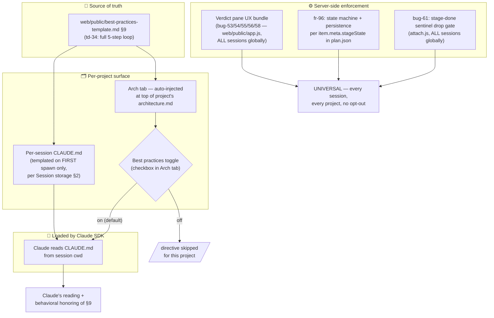

# How the §9 3-stage methodology is enforced — design + finding

**Status:** design doc · 2026-06-04 · author: claude (kkrazy session)

## Question that motivated this doc

> How is the 3-stage methodology enforced for all projects managed by myco?

The §9 directive in `web/public/best-practices-template.md` (last
rewritten as **td-34** — supersedes td-33 r3's auto-iterate clause)
codifies the full state machine: every plan-item dispatch runs
analyze → critic → user-accept → code → critic → user-accept →
verify → critic → user-accept. Each accept can be a button click
on the verdict pane OR a chat phrase. Silence ≠ accept.

Knowing the directive *exists* is one thing; understanding how it's
actually delivered to claude across **every project** + **every
session** is another. This doc is the answer.

## TL;DR

The methodology runs on **three layers of enforcement**, each with
different reach + different strength:

| Layer | What it is | Reach | Enforcement strength |
|---|---|---|---|
| **1. Directive** | td-34's §9 prose explaining the methodology | per-project (opt-in via Arch tab toggle) | **behavioral** — claude reads + honors |
| **2. State machine + UX** | fr-96 stage tracking + bug-53/54/55/56/58 verdict-pane UX | **universal** (every session) | **observable** — server tracks + broadcasts state, modal forces user interaction |
| **3. Server-side hard gate** | bug-61's stage-done sentinel drop in attach.js | **universal** (every session) | **PHYSICAL** — sentinels literally cannot propagate past the gate |

Layer 3 is the safety net that makes the methodology survivable
even when claude tries to violate it. Layers 2 + 3 have **no
per-project opt-out** — they're hard-coded in the server. Only
Layer 1 (the directive prose) can be disabled per-project.

## Architecture diagram



## Layer 1 — Directive (per-project, opt-in)

**File:** `web/public/best-practices-template.md` (the `## 9.` section)

**How it reaches claude:**

1. **Arch tab injection.** The template is rendered live at the top
   of every project's Architecture pane. Visible to the user
   reading the Arch tab. Gated by a "Best practices" checkbox in
   the Arch tab — if unchecked, the §9 directive is skipped for
   that project's UI.

2. **Per-session CLAUDE.md templating.** Per `CLAUDE.md` Session
   storage §2:
   > "`CLAUDE.md` — project-level instructions for the SDK
   > conversation (templated from the myco best-practices block on
   > **first spawn**)."
   
   The per-session `CLAUDE.md` at
   `WORKSPACE/<user>/<session-id>/CLAUDE.md` is templated from the
   best-practices block when the session is FIRST spawned. The
   Claude SDK auto-loads this file from session `cwd`. So
   claude reads the directive as part of its baseline context on
   every turn.

**Enforcement strength: behavioral.** Claude must read the
directive + honor it. There's nothing physically forcing claude
to follow the methodology at this layer — it's the same shape as
any other CLAUDE.md instruction.

## Layer 2 — State machine + Verdict-pane UX (universal, no opt-out)

Server-side code that runs in **every attached session, every
project, globally**. No per-project knob.

### State machine (fr-96)

`server/src/stageState.js` (pure-function module):
- Per-plan-item state: `item.meta.stageState = { stage, status,
  updatedAt, history[] }`
- Stage values: `analyze | code | verify`
- Status values: `in_progress | awaiting_verdict | awaiting_accept`
- Persisted in `rec.artifacts.plan.items[].meta.stageState` →
  survives container restart

Transitions wired in `attach.js`:
- `[run:plan#X]` dispatch → `analyze.in_progress`
- `[stage: X done]` sentinel → `X.awaiting_verdict`
- Critic verdict broadcast (in `critique.js`) → `X.awaiting_accept`
- ✓ Accept Stage button → next stage `in_progress` (`bug-56`)
- ⚡ Ask Claude to Fix Stage → same stage `in_progress` (bug-56)
- ✓ Accept (verify final) → CLEARED (run done, via `bug-57`'s
  `/run/done` route)
- ✗ Discard → CLEARED (run abandoned)

### Verdict-pane UX bundle (bug-53/54/55/56/58)

`web/public/app.js` + `web/public/styles.css`:
- **Truly-modal pane** (bug-55) — outside-click + Esc don't dismiss;
  the user MUST click an explicit button to close
- **Cross-device sync** (bug-54) — `state-update kind:
  'critique-resolved'` broadcast clears the verdict pane on every
  attached device when ANY device resolves it
- **Intermediate buttons** (bug-56) — `✓ Accept Stage` and
  `⚡ Ask Claude to Fix Stage` on intermediate verdicts (not just
  the final one)
- **💬 Ask Critic + follow-up prompt** (bug-53) — user typed
  question is bundled into the critic re-fire as a priority focus
- **Modal scoped to chat-pane width** (bug-58) — modal width ==
  chat-window width; no viewport overflow

### Plan-item lifetime fix (bug-57)

`server/src/attach.js`:
- `session._sawStageSentinelInRun` flag — set when any `[stage: X
  done]` sentinel fires; reset on next `[run:plan#X]` dispatch
- On `turn_result` success, `_activeRunItem` is cleared ONLY if no
  sentinel was seen (legacy one-shot dispatch). Multi-stage runs
  keep `_activeRunItem` alive across turns so stages 2 + 3 can
  still fire critiques.
- `POST /sessions/:id/run/done` route — called from `✓ Accept
  Claude` (verify-stage final) + `✗ Discard` to formally end the run

**Enforcement strength: observable.** The server tracks every
state transition, persists it, broadcasts it to every attached
device, and the modal verdict pane forces the user to interact
before silently advancing. Claude can't make the modal
disappear by emitting more sentinels — only user action closes it.

## Layer 3 — Server-side hard gate (universal, PHYSICAL)

**File:** `server/src/attach.js` — `session.on('stage-done', ...)`
handler

**Wiring (bug-61):**

```js
// bug-61: pause enforcement. Check stageState BEFORE
// transitioning + firing the critic.
const curStageState = stageStateMod.getStageState(item);
if (curStageState && (
  curStageState.status === 'awaiting_verdict' ||
  curStageState.status === 'awaiting_accept'
)) {
  console.log(`[bug-61] dropping stage-done(${stage}) for ` +
    `${active.itemId} — current stageState is ` +
    `${curStageState.stage}.${curStageState.status}; ` +
    `claude must wait for the user to signal accept-stage / ` +
    `fix-stage on the existing verdict first`);
  return;
}
```

**Enforcement strength: PHYSICAL.** If claude in any session
emits a second `[stage: X done]` sentinel while an earlier stage's
verdict is still pending review (status is `awaiting_verdict` or
`awaiting_accept`), the server **literally drops the sentinel**:
- No state transition fires.
- No critic call fires.
- No diff is generated.
- The drop is logged with a `[bug-61]` prefix for audit.

This is the safety net. Even if claude has stale CLAUDE.md content
from before td-34 shipped, even if the user has the "Best
practices" toggle off, even if claude tries to barrel through
stages — the server physically blocks the second sentinel.

**Complementary client-side guard (bug-61 part 2):**
`app.js`'s `critique-review` WS handler also drops incoming
intermediate broadcasts that would overwrite an unresolved
intermediate verdict — race-safety net for the (rare) case where
a broadcast slips through during a user interaction.

## Honest gaps in the chain

1. **Stale per-session CLAUDE.md.** The templating only fires on
   **first spawn**. Sessions spawned before td-34 shipped still
   have the old td-33 r3 auto-iterate language in their per-session
   `CLAUDE.md`. The Arch tab injection rescues the visible
   documentation, but claude's SDK trusts its CLAUDE.md as
   primary context. **Mitigation:** Layer 3 (bug-61 hard gate)
   makes this survivable — even if claude reads the old directive
   and tries auto-iterate, the server drops the second sentinel.
   **Follow-up worth filing:** a refresh job that re-templates
   per-session CLAUDE.md when the methodology version bumps.

2. **Best-practices toggle.** A project can disable Layer 1.
   Layers 2 + 3 still operate (no opt-out), but the user loses the
   prose explanation of the methodology. They'd see the modal +
   the state-machine status without context. **Mitigation:** the
   modal verdict pane is self-explanatory — the buttons are
   labeled clearly. Worst case: confused first-time user.

3. **Layer 1 alone is not sufficient.** If we only had the
   directive (no Layer 3), claude could (and empirically DID, in
   the very session that shipped fr-95 + bug-53 + bug-55) violate
   the pause. The user reported it explicitly:
   > "during the process it automatically moved to next stage
   > before I accept the result of the check point verdict"
   That observation is what motivated bug-61. Layer 3 is what
   makes the methodology actually deliver.

## Implication for new work

When shipping a fix that touches the methodology — for example
**bug-63** (specialty critic aggregation), which I'm analyzing
right now — the fix lives in Layer 2 (`critique.js` aggregation
logic + specialty prompts under
`server/src/critics/specialties/`). That means:
- It applies **universally** to every session as soon as it ships
- No per-project configuration needed
- No CLAUDE.md propagation problem (the fix isn't in CLAUDE.md)

This is the **good case**. Most methodology fixes land in Layer 2
or 3 and are immediately universal.

The only methodology changes that DON'T propagate cleanly are
ones in Layer 1 (directive prose). Those need either:
- A re-template job (bug-XX above), OR
- Manual update to existing projects' `CLAUDE.md` files

## References

| Fix | What | File / route |
|---|---|---|
| td-33 | Stage-aware critic + retry button | `critique.js`, `app.js` |
| td-33 r2 | Critic context enrichment | `critique.js` |
| td-33 r3 | Persistent §9 directive + (deprecated) auto-iterate | `best-practices-template.md` |
| td-34 | §9 directive rewrite — user-driven 5-step loop | `best-practices-template.md` |
| fr-95 | Specialized critics fan-out (general + test-validity + perf-security) | `critics/specialties/*` |
| fr-96 | Per-plan-item state machine | `stageState.js`, `attach.js`, `app.js` |
| bug-53 | 💬 Ask Critic button on verdict pane | `app.js`, `styles.css` |
| bug-54 | Cross-device verdict-pane sync | `critique.js`, `app.js` |
| bug-55 | Truly-modal verdict pane (no backdrop dismiss) | `app.js`, `styles.css` |
| bug-56 | ✓ Accept Stage + ⚡ Ask Claude to Fix Stage on intermediate | `app.js`, `styles.css` |
| bug-57 | `_activeRunItem` lifetime fix | `attach.js`, new `/run/done` route |
| bug-58 | Verdict modal scoped to chat-pane width | `styles.css` |
| bug-61 | **Server-side stage-done sentinel drop gate** (the physical enforcement) | `attach.js` |
| bug-63 | (in flight) Specialty critic aggregation drives overall hasDisagreement | `critique.js`, specialty prompts |
