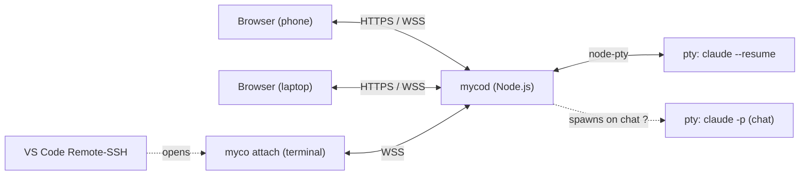
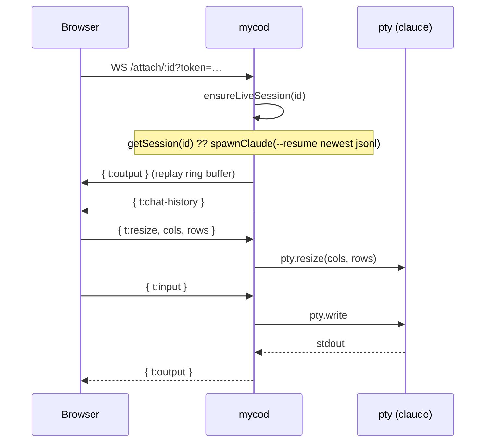
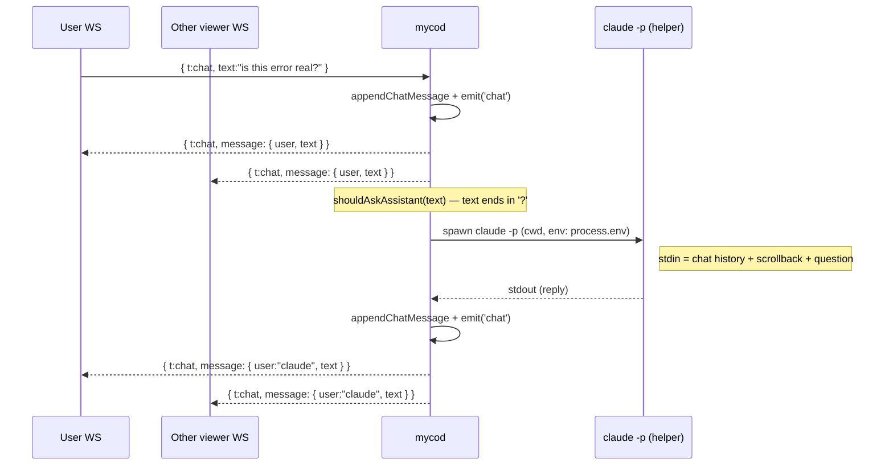
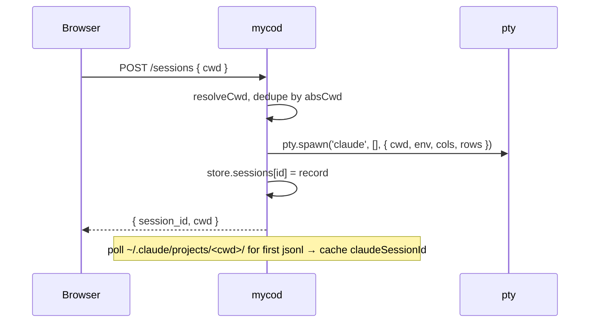

# Mycelium — Architecture

## Overview

myco (codename: Mycelium) is a web UI to monitor, control, and discuss Claude Code sessions running locally on the same host as the server. Mobile-first, with a custom keyboard tuned for Claude Code's interaction patterns.



A single mycod process owns the pty for each running `claude` session. Multiple viewers (phone, laptop, VS Code via the bundled CLI) attach to the same pty over WebSocket; bytes are fanned out to every connected viewer.

---

## Components

### Server (`server/`)

A single Node.js process. No external services, no SSH, no database — state is a JSON file.

| File | Lines | Responsibility |
|------|------:|---------------|
| `src/index.js` | 308 | Express + ws bootstrap; HTTP/HTTPS listen, route handlers, WS upgrade auth |
| `src/sessions.js` | 439 | Session store (`~/.myco/store.json`), spawn/list/delete, transcript import, chat history |
| `src/pty.js` | 216 | `PtySession` wrapper around node-pty; WS attach handler; chat broadcast; `/btw` trigger |
| `src/auth.js` | 90 | Bearer-token auth (`MYCO_TOKEN` / `MYCO_TOKENS`); read-only share tokens |
| `src/btw.js` | 117 | Spawns `claude -p` for chat replies; ANSI-strip; question-detection heuristic |
| `src/summarizer.js` | 164 | Background watcher that calls Anthropic API to title sessions from their transcripts |
| `src/logCapture.js` | 57 | Tees `console.log`/`error` so `/logs` (HTTP + WS) can stream them to the UI |

### Web (`web/public/`)

Static SPA — Express serves it with `Cache-Control: no-store`, so a tab refresh always picks up the latest.

| File | Lines | Responsibility |
|------|------:|---------------|
| `index.html` | — | Shell: sidebar (sessions), terminal pane, chat pane, modals |
| `app.js` | 962 | State, auth, session list, terminal attach, chat, log panel, share-link viewer |
| `keyboard.js` | 135 | Mobile soft keyboard (Esc / Esc-Esc / 1-3 / Enter, native-input toggle) |
| `styles.css` | — | Mobile-first layout, dark theme, mutually-exclusive sidebar/chatpane on mobile |
| `vendor/xterm/*` | — | xterm.js + WebGL/Canvas/Fit addons (vendored from `node_modules` at install time) |

### CLI (`cli/`)

| File | Lines | Responsibility |
|------|------:|---------------|
| `index.js` | 144 | Headless WS client over `/attach/<id>`; raw-mode stdin/stdout proxy; `Ctrl-] q` to detach |

The shipped `myco` shell shim re-exports `server/node_modules` so the CLI uses the server's `ws` install.

---

## State

### `~/.myco/store.json`

The single source of truth. Shape:

```json
{
  "sessions": {
    "myco-kkrazy-abcd1234": {
      "id": "myco-kkrazy-abcd1234",
      "user": "kkrazy",
      "cwd": "myco",
      "absCwd": "/home/kkrazy/myco",
      "claudeSessionId": "9f1a...",
      "createdAt": "2026-05-07T08:00:00.000Z",
      "aiSummary": "Wiring TLS for myco.labxnow.ai",
      "summaryGeneratedAt": "2026-05-07T08:30:00.000Z",
      "chat": [{ "user": "kkrazy", "text": "hi", "ts": "..." }, ...]
    }
  },
  "shareTokens": { "<tok>": { "sessionId": "...", "expiresAt": ..., "issuedBy": "..." } },
  "dismissed": [ /* cwds the user told us not to auto-import */ ]
}
```

`claudeSessionId` is the cached id of the *first* transcript jsonl observed after spawn; at attach time, `ensureLiveSession` ignores it and resumes whichever jsonl is newest in `~/.claude/projects/<encoded-cwd>/`. That makes `/clear` and `/resume` survive a server restart.

### `~/.claude/projects/<encoded-cwd>/*.jsonl`

Owned by Claude Code, not us. We poll mtimes here to derive `last_activity` and `status` (active / recent / stale / idle), to find the resume target, and to import sessions that exist in Claude's history but aren't yet in our store.

### `<wks>/<user>/<session>/<project>/_myco_/` — portable artifact mirror

The plan / test / architecture artifacts (`rec.artifacts.plan`, `rec.artifacts.test`, `rec.artifacts.arch`) are **always mirrored to a `_myco_/` directory inside the project root**, where the project root is the directory that contains `.git/`. This is the single, canonical location — the artifact code does not write or read these files anywhere else.

```
<wks>/<user>/<session>/<project>/
├── .git/                     ← marks this dir as the project root
├── <source>…
└── _myco_/
    ├── plan.json             ← items + comments + voters + done state
    ├── test.json             ← items + comments + done state (no votes)
    ├── architecture.md       ← long-form arch markdown
    └── README.md             ← written once explaining the dir (preserved if user-edited)
```

**Why a directory committed alongside source.** The state that lives in `store.json` (`MYCO_STATE_DIR/sessions.json`) is *session*-scoped — tied to one user's myco instance. The `_myco_/` mirror is *project*-scoped: a teammate clones the repo, starts a fresh myco session at the project root, and the next GET on the Plan / Test / Arch tab reads the on-disk files and renders the same items + comments the original author left behind. No session-state migration step, no manual export. **Commit the dir, push it, and it travels with the source.**

**Project-root resolution** — done in `server/src/artifacts.js` via `findProjectRoot(rec)`:

1. If `session.absCwd/.git/` exists → project root = `session.absCwd` (the session points directly at a checkout).
2. Else, the *first* immediate subdirectory of `session.absCwd` that contains `.git/` (alphabetical for determinism when multiple repos coexist) → project root = that subdir (the session points at a workspace ABOVE the checkout, matching the literal `<wks>/<user>/<session>/<project>` path pattern).
3. Else → no project; the artifact code skips the file mirror entirely. Heavy / hidden directories (`node_modules`, `dist`, `.cache`, `.next`, etc.) are skipped during the scan so a stray `.git/` inside a dependency can't impersonate a project.

**Read / write contract**:

- **Read priority on GET `/sessions/:id/artifact`**: `<project>/_myco_/<type>.<ext>` first; if absent, the legacy root-level `<project>/architecture.md` (for arch only); else fall back to `rec.artifacts[type]` from `store.json`. When the file wins, its content is mirrored back into `rec.artifacts[type]` so other code paths see a consistent shape.
- **Write on every mutation** (`refresh` / `run` / `mark` / `vote` / `comment` / `item delete`): `persistArtifact(rec, type, artifact)` saves `store.json` *and* writes the canonical file under `<project>/_myco_/`. `README.md` is written once on first use and never overwritten (so a hand-customised README survives).
- **Backfill on first read**: if the file is absent but `rec.artifacts[type]` already has content (e.g. a pre-`_myco_/` session that never mutated since the deploy), the GET handler eagerly writes the file so the directory materialises in the file explorer immediately and the user can `git add _myco_/` without first triggering a mutation.

**File format**:

- `plan.json` / `test.json` — pretty-printed JSON, trailing newline:

  ```json
  {
    "items": [
      {
        "id": "695feda01a0a",
        "text": "After redeploy, the claude session enters resume window and …",
        "layer": "Bug",
        "done": false,
        "addedAt": "2026-05-12T10:07:39.717Z",
        "addedBy": "kkrazy",
        "source": "user",
        "voters": [],
        "comments": [{ "id": "...", "user": "...", "text": "...", "ts": "..." }]
      }
    ],
    "updatedAt": "2026-05-14T03:43:13.099Z"
  }
  ```

- `architecture.md` — plain markdown body.

---

## API

### HTTP

| Method | Path                      | Description                                                                |
|--------|---------------------------|----------------------------------------------------------------------------|
| `GET`  | `/auth/check`             | Token check; returns `{ ok, user }` or `{ share, sessionId }` for `?s=`.   |
| `GET`  | `/sessions`               | List sessions (filtered by user when auth is on).                          |
| `POST` | `/sessions`               | Spawn: `{ cwd, cols?, rows? }` → `{ session_id, cwd }`. Auto-creates dir.  |
| `DELETE` | `/sessions/:id`         | Kill the pty + remove from store. Transcript on disk is preserved.         |
| `POST` | `/sessions/:id/share`     | Issue a read-only share token; returns `{ url, expires_at }`.              |
| `POST` | `/sessions/:id/vscode-prep` | Drop a `.vscode/tasks.json` in the cwd that auto-runs `myco attach <id>` on folder open. |
| `GET`  | `/workspace`              | `{ name, entries, user, vscode_host }` for the spawn modal.                |
| `GET`  | `/logs?count=N`           | Recent server log lines.                                                   |

### WebSocket

#### `/attach/:session_id` — terminal + chat

Auth: `?token=<bearer>` for normal users, `?s=<share-token>` for read-only viewers.

```
client → server:
  { "t": "input",  "data": "<base64 utf-8 bytes>" }
  { "t": "resize", "cols": 80, "rows": 24 }
  { "t": "ping" }
  { "t": "chat",   "text": "hello" }

server → client:
  { "t": "output",       "data": "<base64 utf-8 bytes>" }
  { "t": "exit",         "code": 0 }
  { "t": "pong" }
  { "t": "chat-history", "messages": [...] }   // sent once on attach
  { "t": "chat",         "message": { user, text, ts } }
  { "t": "error",        "message": "..." }
```

The server fans `output` and `chat` to every WS attached to the same session id. Read-only (share-link) viewers get `output`, `exit`, `chat-history`, `chat`, and `pong`, but their `input` / `resize` / `chat` messages are dropped.

#### `/logs`

Same auth, server pushes `{ t: "log", level, ts, msg }` for each captured server-side log line.

---

## Mobile Keyboard

The custom keyboard is the primary product surface on phones — the OS soft keyboard is suppressed by default (`inputmode="none"` on xterm's hidden textarea), and key chords are tap-encoded.

### Byte Mappings

| Button | Bytes |
|--------|-------|
| Esc | `\x1b` |
| Esc-Esc (double-tap within 280ms) | `\x1b\x1b` (one frame) |
| 1 / 2 / 3 | `1` `2` `3` |
| Enter | `\r` |

The "ABC" toggle swaps to a native `<input>` that buffers locally and ships on Enter — typing in this mode raises the OS keyboard but feels responsive (no per-keystroke RTT).

### UX Rules

- Each tap is its own WS frame — no debouncing.
- Haptic feedback per tap via `navigator.vibrate(10)`.
- Sidebar and discussion pane are **mutually exclusive on mobile** (≤900px) and both visible alongside the terminal on desktop.
- After bare `Esc` (or `Esc-Esc`), the client briefly toggles the pty rows (rows-1 → rows over ~32ms) to force claude to repaint the full viewport — works around occasional stale-bottom-row artifacts.

---

## Data Flow

### Terminal Attach



### Discussion + `/btw`



The chat helper inherits `process.env`, so it uses whichever auth (`ANTHROPIC_API_KEY` or `claude.ai` subscription token in `~/.claude/`) the main interactive `claude` session uses.

### Session Spawn



---

## Operational Notes

- **Auth disabled by default.** When neither `MYCO_TOKEN` nor `MYCO_TOKENS` is set, every request is user `default`. Don't expose unauthenticated mycod to the public internet.
- **TLS in-process.** When `TLS_CERT_PATH` + `TLS_KEY_PATH` are set, mycod terminates HTTPS itself and runs an HTTP→HTTPS redirect on `:80`. The shipped `myco.service` grants `CAP_NET_BIND_SERVICE` so this works as a non-root user.
- **One pty per session, shared by all viewers.** When a small viewport (phone) and a large one (laptop) attach the same session, the last-resize wins — claude renders for whichever client most recently sent `{ t: resize }`. Per-viewer rendering is not supported.
- **Liveness.** Server WS-pings every 30s with a 30s grace. Browser pings on `visibilitychange → visible` / `focus` / `pageshow` and every 15s while visible — closing + reconnecting if no pong in 2s.
- **Persistence.** All durable state lives in `MYCO_STATE_DIR/store.json` (default `~/.myco/`). The Claude transcripts under `~/.claude/projects/` are owned by Claude itself and are never written to by mycod.
