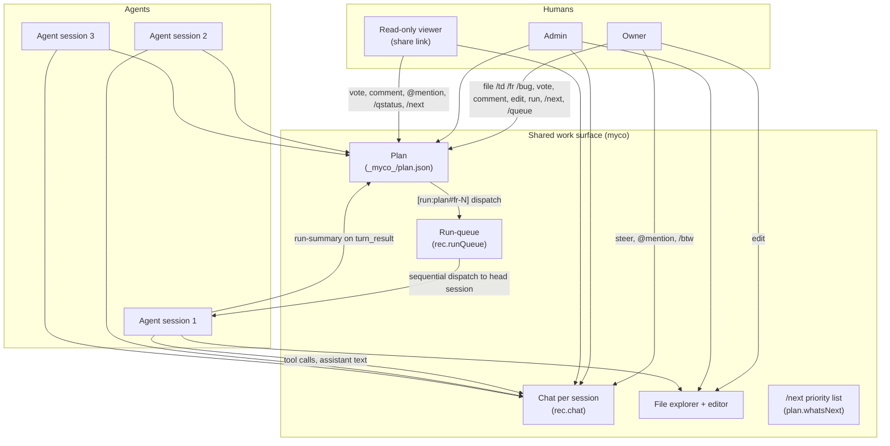
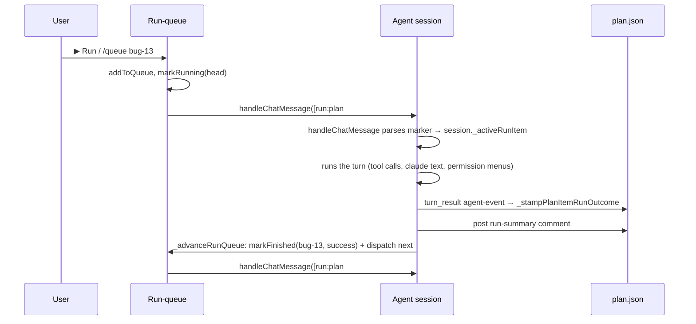

# myco — Architecture

## Thesis

**myco is the shared work surface where humans and autonomous agents collaborate on the same project, in real time, across devices, with full audit trail.**

Three concrete properties drive every design choice:

1. **Many agents and many humans, one project**. A project is hosted by myco; humans + agents attach to it. Multiple agent sessions can run in parallel against the same workspace. Multiple humans can attach to the same session (owner, admin, read-only viewers). Coordination is via shared backlog, shared chat, and shared presence — not via "who's currently at the terminal."
2. **Plan items are the work primitive**. Every piece of work — a user-reported bug, a feature request, a refactor todo, an agent-suggested improvement — is filed as a plan item with votes, comments, run history, and a Run button. The plan IS the project's running state. Everything else (agent sessions, chat, file edits) is in service of advancing items on it.
3. **State moves with the code**. The plan, the architecture notes, the agent's per-item run-summaries — all live in a git-tracked `_myco_/` directory inside the project root. `git clone` is the entire onboarding step. New teammates inherit complete project memory; collaborators on another laptop see the same backlog.



---

## Components

### Server (`server/`)

A single Node process. No external services required at runtime — state is plain JSON files. Caddy in front for TLS + HTTP/2.

| File | Responsibility |
|---|---|
| `src/index.js` | Express + ws bootstrap, route handlers, WS upgrade auth, log capture wiring |
| `src/sessions.js` | Session registry + chat persistence (cap 100k msgs/session, monotonic `meta.seq`) |
| `src/agent-session.js` | The agent runtime wrapper — driven by the pluggable agent SDK (currently `@anthropic-ai/claude-agent-sdk`). Exposes `chat`, `state-update`, `agent-event`, `exit`, `idle` events. Handles permission requests, retries, resume-failure fallback, abort |
| `src/attach.js` | WebSocket attach plane — owner + viewer paths, presence broadcast, chat handling, run-queue auto-advance hook |
| `src/artifacts.js` | The `_myco_/` artifact mirror — plan/test/arch read+write, vote/comment/edit/run routes, run-queue HTTP routes |
| `src/runQueue.js` | Sequential dispatch primitives (`addToQueue`, `peekNextPending`, `markRunning`, `markFinished`, pause/resume) |
| `src/whatsnext.js` | Heuristic priority scoring + LLM rerank for `/next`. 2h refresh-on-read cache |
| `src/slashcmds.js` | Slash-command dispatcher (`/td /fr /bug /queue /q* /admin /next /help` ...) |
| `src/menu.js` | Permission menu state, persistence into chat, fan-out to attached clients |
| `src/auth.js` + `src/git-tokens.js` | GitHub OAuth flow + allowlist + PAT store |
| `src/btw.js` | Side-channel agent invocation (`runClaudeP`) — single-turn, no tools, no chat pollution. Used by `/btw`, `/fr!` rewriting, `/next` LLM rerank |
| `src/logCapture.js` | Rolling stdout/stderr buffer for the `/logs` panel and `collect-logs.sh` poller |

### Client (`web/public/`)

Static SPA — Express serves with `Cache-Control: no-store`, so a tab refresh always picks up the latest build.

| File | Responsibility |
|---|---|
| `index.html` | Shell: sidebar, chat pane, chrome icon cluster (Plan / Arch / Test / Files), modals (spawn, permission, file-conflict) |
| `app.js` | State, auth, session list, WS attach, chat rendering, agent-event rendering, file explorer + editor, slash commands client mirror |
| `styles.css` | Mobile-first dark theme, mutually-exclusive sidebar/chat on mobile |
| `vendor/codemirror.bundle.js` | CodeMirror 6 IIFE bundle (built from `tools/codemirror-entry.mjs` via `npm run build:editor`) |
| `vendor/*` | Other vendored deps — marked, highlight.js, mermaid |

### Build tooling (`tools/`)

| File | Responsibility |
|---|---|
| `tools/codemirror-entry.mjs` | esbuild input — imports CM6 packages + 6 language modes + oneDark theme, exposes `window.MycoCM` |

---

## The agent backend is pluggable

`AgentSession` (`server/src/agent-session.js`) is the integration boundary. Its public surface — the events it emits, the methods it exposes — is the contract that the rest of the server talks to. Behind that contract is a single concrete implementation today, with a second filed as `fr-52`:

| Adapter | Status | Notes |
|---|---|---|
| Anthropic agent SDK (`@anthropic-ai/claude-agent-sdk`) | Active | In-process `query()` loop, `canUseTool` callback, `PreToolUse` hook for permissions, MCP tool servers |
| OpenAI Agents SDK (`@openai/agents`) | Planned (`fr-52`) | `Runner.run()` + guardrails/pre-tool hooks for permissions. PoC scope, not full feature parity |

The integration contract is intentionally narrow so adding a third backend in the future is a self-contained adapter, not a fork.

---

## State

### Container-level (per host)

```
$MYCO_STATE_DIR/
├── sessions.json            ← session registry: roles, chat history, run-queue
├── auth-sessions.json       ← minted myco session tokens (30-day sliding TTL)
├── git-tokens.json          ← OAuth + per-repo PAT store
├── allowed-github-users.txt ← invitation allowlist
├── .env                     ← MYCO_GH_CLIENT_ID / SECRET / PUBLIC_ORIGIN
├── Caddyfile                ← reverse proxy + TLS termination
├── home/                    ← agent SDK config (auth credentials)
└── wks/<user>/<session>/    ← per-session workspace bind-mount
```

### Per-session workspace

```
/wks/<user>/<session>/<project>/
├── .git/                    ← marks this dir as the project root
├── <source>…
├── CLAUDE.md                ← agent-facing convention pack (auto-templated)
├── .claude/
│   ├── settings.json        ← per-project agent settings
│   ├── settings.local.json  ← persisted "Allow always" picks
│   └── memory/              ← agent auto-memory (session-scoped)
└── _myco_/                  ← team-visible project memory (git-tracked)
    ├── plan.json            ← items + voters + comments + runs + whatsNext cache
    ├── architecture.md
    ├── bash-elapsed.json    ← rolling slow-command samples for runtime hygiene
    └── README.md
```

**Why `_myco_/` is checked in.** Without it, every fresh clone or new teammate starts with no project memory — they re-discover slow commands, re-vote on done items, re-ask the same architectural questions. With it, the team operates on shared ground truth and onboarding is `git clone`.

The directory is a first-class artifact: every plan mutation persists immediately to both `sessions.json` (the running cache) and the on-disk file. A teammate who pulls the repo and opens the Plan tab in their own myco session sees the same backlog the original author left behind, without a state-export step.

---

## Roles + permissions

Every WebSocket attach is classified into one of three roles. The role determines what the chat input is allowed to forward to the agent.

| Role | How acquired | Can drive agent | Can mutate plan | Can edit files | Server enforcement |
|---|---|---|---|---|---|
| Owner | Spawned the session | ✓ | ✓ | ✓ | `rec.user === reqUser` |
| Admin | `/admin <login>` by owner | ✓ | ✓ | ✓ | `rec.admins.includes(reqUser)` |
| Read-only viewer | Share-link OR not in session's allow-list | — | partial (file plan items, vote, comment, `@mention`) | — | `attachViewerWebSocket` filters inbound, `handleChatMessage` whitelists guest commands |

**Client-side mirror**: the Send button auto-disables when the typed text wouldn't pass the server's guest whitelist. The two whitelists (server: `attach.js GUEST_ALLOWED_CMDS`, client: `app.js _GUEST_ALLOWED_CMDS`) MUST stay in sync; the bug-19 regression test pins this contract.

Presence is broadcast on every attach/detach: every client receives the role-tagged user roster so the header chip cluster reflects "who's here right now."

---

## Plan items as the work primitive

Every piece of work — bug, feature, todo — is a plan item. The item is the unit of:

- **Discussion** (comments thread, with edit + delete for owner/admin)
- **Voting** (each unique voter adds priority weight to `/next`)
- **Dispatch** (`▶ Run` button or `/queue <id>` enqueues to the run-queue)
- **Audit trail** (run-summaries posted back as `meta.kind: 'run-summary'` comments)
- **State** (`done` flag with `Close` / `Reopen` button; creator chip; per-layer label)

**Item shape:**

```jsonc
{
  "id": "bug-13",
  "text": "**Problem:** Chrome batch messages are only visible to the session owner...",
  "layer": "Bug",                          // Bug | Feature | Todo
  "done": false,
  "addedAt": "2026-05-18T16:31:08.834Z",
  "addedBy": "kkrazy",
  "voters": ["kkrazy", "ryan-blues"],
  "comments": [
    { "id": "...", "user": "kkrazy", "text": "still seeing this", "ts": "..." },
    { "id": "...", "user": "claude", "text": "✓ success · 2m18s · ...",
      "ts": "...", "meta": { "kind": "run-summary" } }
  ],
  "runs": [
    { "status": "success", "ts": "...", "startedAt": "...", "summary": "2m18s · 1.2k tok" }
  ],
  "meta": { "rewriteRequested": "long", "originalText": "...", "rewritten": true }
}
```

### Dispatch flow



The `[run:plan#<id>]` marker is the binding contract — `handleChatMessage` parses it to set `session._activeRunItem`, the post-turn-result hook reads it back to mark the queue entry finished. A belt-and-braces fallback (added in fr-51) re-derives the active id from the queue's `running` entry if `_activeRunItem` is unexpectedly null, with a `[runQueue-diag]` log line so the underlying staleness can be root-caused later.

---

## Run-queue

Per-session FIFO with auto-pause on failure. Lives at `rec.runQueue`. Entries are `{ itemId, type, status, addedAt, startedAt, finishedAt, addedBy }`.

**Status transitions:** `pending → running → (success | failed | aborted)`. On `failed`/`aborted` the queue auto-pauses (`rec.runQueuePaused = true`) and broadcasts a chat note prompting `/qresume`. On `success`, `_advanceRunQueue` picks the next pending and re-dispatches.

**Five dispatch sites** all funnel through `peekNextPending` + `markRunning` + `handleChatMessage(buildArtifactRunText(...))`:
1. `/queue <id>` slash command (initial kick when queue is idle)
2. `/qresume` slash command (after auto-pause)
3. `/qcancel <id>` (auto-advance after force-removing the running head)
4. `POST /queue/add` HTTP route (▶ Run button kick when queue is idle)
5. `_advanceRunQueue` agent-event hook (post-turn-result auto-advance)

---

## `/next` priority list

`server/src/whatsnext.js` — heuristic + best-effort LLM rerank, cached 2h in `plan.whatsNext`.

**Heuristic score**:
- voters × 3.0 (each unique voter)
- comments (capped at 5) × 1.0
- layer bias (Bug 2.0 · Feature 1.0 · Todo 0.5)
- fresh (<7d) +2.0 · stale (>90d) −0.5
- last run failed/aborted −1.5
- done items + items already in the run-queue excluded

The top 20 candidates are passed to a single-turn agent call (`btw.runClaudeP`, no tools, 60s timeout) with a priority rubric. The parser rejects hallucinated ids and dedups; LLM failure falls back silently to the heuristic order so the command always returns something useful.

---

## Chat persistence + cross-device consistency

The chat surface is the central conversational record. The contract has three pillars:

1. **Server is the only source of truth** — `rec.chat` in `/data/sessions.json` + `session.buffer` + `_myco_/events.jsonl`. Every attached client renders the same state. No device-local chat storage.
2. **All history persisted indefinitely** — every user message AND every agent reply (`_persistAssistantTextToRecChat` mirrors each `assistant_text` block). Retention cap is 100,000 messages per session (effectively unbounded). Survives container restarts, reaper kills, deploys.
3. **Chronological order via monotonic seq** — every row carries an ISO `ts` AND a server-allocated `meta.seq` (per-session counter via `sessions.allocSeq`). Reload, replay, and live-append all sort by seq. A brief network blip triggers `?afterSeq=N` catch-up on reconnect — only the missed window streams back, not the full tail.

**Regression guard**: `test/chat-persistence-contract.test.js` locks all three pillars. Touching `getChatHistory`, `appendChatMessage`, `_persistAssistantTextToRecChat`, `MAX_CHAT_MESSAGES`, or the `/chat/history` route must keep these tests green.

---

## File editor

CodeMirror 6 vendored bundle (`web/public/vendor/codemirror.bundle.js`, built via `npm run build:editor`). Modes: js/ts/json/md/html/css/python + oneDark theme. Editor instantiated via `window.MycoCM.createEditor`.

**Concurrent-edit safety** is optimistic mtime checking, not locking:

- `GET /sessions/:id/file` returns `mtimeMs` in the response; client stamps it
- `POST /sessions/:id/file/edit` requires `expectedMtimeMs`; server rejects with 409 `ERR_MTIME_CONFLICT` if disk mtime drifted
- Client surfaces a conflict modal: **Reload from disk** (discard edits) / **Force overwrite** (re-stat + retry) / **Cancel** (preserve edits in the editor for copy-out)

Bytes are never silently lost. Lock-based or CRDT-based concurrency is filed in the backlog for if/when the optimistic model proves insufficient.

---

## API surface

### HTTP

| Method | Path | Description |
|---|---|---|
| `GET` | `/auth/check` | Auth status; `{ ok, user }` or `{ share, sessionId }` for `?s=` |
| `GET` | `/sessions` | List sessions (filtered by user) |
| `POST` | `/sessions` | Spawn a new session |
| `DELETE` | `/sessions/:id` | Delete (owner only) |
| `POST` | `/sessions/:id/share` | Mint a share-link token |
| `GET` | `/sessions/:id/files` | List directory entries (file tree) |
| `GET` | `/sessions/:id/file` | Read file (returns `{ content, mtimeMs, size }`) |
| `GET` | `/sessions/:id/file/download` | Download as attachment |
| `POST` | `/sessions/:id/file/edit` | Write file (owner only, requires `expectedMtimeMs`) |
| `GET` | `/sessions/:id/artifact?type=plan\|test\|arch` | Read artifact |
| `POST` | `/sessions/:id/artifact/run` | Dispatch a plan item (▶ Run button) |
| `PATCH` | `/sessions/:id/artifact/item` | Edit item body (fr-46) |
| `PATCH`/`DELETE` | `/sessions/:id/artifact/comment` | Edit / delete comment |
| `POST` | `/sessions/:id/queue/add` | Enqueue an item |
| `DELETE` | `/sessions/:id/queue/:itemId` | Remove a queue entry |
| `POST` | `/sessions/:id/queue/clear` | Drop all pending |
| `POST` | `/sessions/:id/queue/resume` | Unpause + dispatch next |
| `GET` | `/auth/github/start` + `/auth/github/callback` | OAuth flow |
| `GET` | `/logs?n=N` | Recent server log lines (bearer-gated) |

### WebSocket — `/attach/:session_id`

Auth: `?token=<bearer>` for owners/admins, `?s=<share-token>` for guests. Optional `?afterSeq=N` for lossless reconnect catch-up.

**Server → client frames** (selected):

```
{ "t": "viewer-mode", "owner": "kkrazy" }            // attach as guest
{ "t": "chat-history", "messages": [...] }            // initial ~1 KB tail
{ "t": "agent-replay", "events": [...] }              // initial ~16 KB tail
{ "t": "chat", "message": { user, text, ts, meta } }
{ "t": "agent-event", "event": { ... } }              // tool_use / tool_result / assistant_text / permission_request / turn_result
{ "t": "state-update", "kind": "artifact" | "runQueue" | "presence", ... }
{ "t": "presence", "users": [...] }
{ "t": "menu", "menu": { ... } }
{ "t": "exit", "code": 0 }
{ "t": "pong" }
```

**Client → server frames**:

```
{ "t": "chat", "text": "hello" }
{ "t": "menu-pick" | "menu-toggle" | "menu-submit", "n": N, "hash": "..." }
{ "t": "interrupt" }
{ "t": "ping" }
```

---

## Diagnostics + observability

- **`/logs` endpoint** — rolling 5000-line stdout/stderr buffer from `logCapture.js`. Exposed bearer-gated; powers the in-UI log panel + `./collect-logs.sh`
- **`collect-logs.sh`** — human/cron-runnable poller. Dedups against per-UTC-day files under `_myco_/logs/` (gitignored). Supports local mycod + mycobeta via SSH
- **`/loop` cron** — diagnostic tick that periodically runs `collect-logs.sh` + scans for known markers (`[ws-attach]`, `[diag-resume]`, `[menu-pick]`, `[runQueue-diag]`). Posts a one-line `📡 [diag-loop]` summary to chat each tick
- **Bracketed log markers** — every instrumented site uses a stable prefix (`[ws-attach]`, `[plan-run]`, `[runQueue]`, etc.) so filters can pick them out unambiguously

---

## Deployment

`./deploy.sh` is the contract:

- Builds the Docker image locally
- Streams it to the remote host over SSH
- Swaps the container against a single bind-mounted state directory (`MYCO_STATE_DIR`)

The state directory is the entire backup unit — tar it and you have a full restore. No named/anonymous Docker volumes; nothing in the container survives a swap except what's bind-mounted.

See `## Deployment` in [CLAUDE.md](./CLAUDE.md) for the single-state-dir layout, mycobeta deploy recipe (deploy-on-host because local Docker is often unavailable), OAuth wiring, and TLS specifics.

---

## What's NOT in the architecture (intentionally)

- **No external database**. State is plain JSON files on disk. Backup = tar; restore = untar. Concurrent writes serialize via `sessionsMod.saveStore`'s in-process mutex.
- **No background scheduler primitive**. `/next` is refresh-on-read with a 2h TTL — no cron timer burning tokens when no one is looking.
- **No PTY / terminal multiplexer**. Phase 9 retired all PTY-driven session code. Every session runs as an `AgentSession` driven by the agent SDK. Tool calls and permission menus come through structured SDK events, never by regex-matching rendered text. Static checks in `./test.sh` enforce the deletion.
- **No multi-region / sharding**. Single host, single Node process. State directory mountable on a shared filesystem for HA in principle, but not the target deploy shape today.
