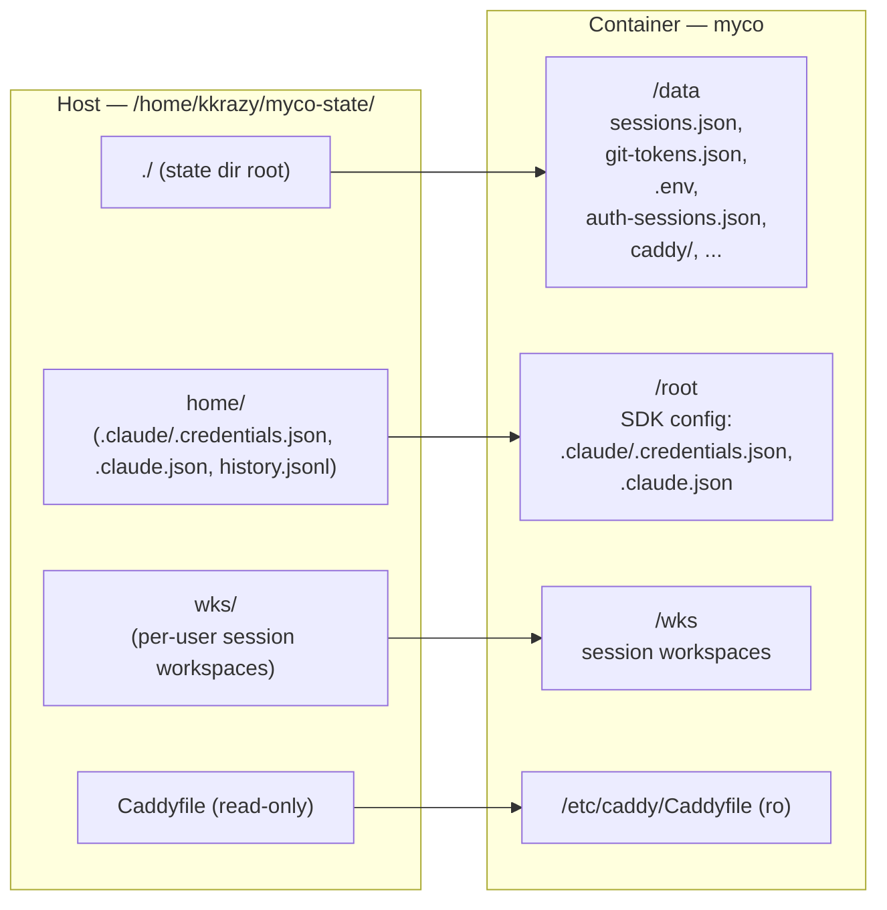

# Myco — Deploy & Operations Guide

Focused operational reference for deploying, troubleshooting, and
rotating credentials on myco's deploy targets. The high-level rules
(WHEN to deploy, WHAT scripts to use) live in `CLAUDE.md`
"Deployment §0-§5"; this file documents the WHERE + HOW with concrete
paths, command snippets, and diagnostic flows.

---

## 1. Deploy targets

| Host | Role | Notes |
|---|---|---|
| `myco.labxnow.ai` | **Production** | Default `MYCO_DEPLOY_HOST`. Deploy with `./scripts/deploy.sh` from the project root. |
| `mycodev.labxnow.ai` | **Development** | Same on-host recipe as mycobeta. SSH access pre-shared as `kkrazy@mycodev.labxnow.ai`. |
| `mycobeta.labxnow.ai` | **Staging** | Same on-host recipe as mycodev. |
| `opti.labxnow.ai` | **RETIRED** — do not deploy. | The pre-2026-05-27 prod host. |

**Hard rule from CLAUDE.md §0:** never deploy unless the user
explicitly says "deploy", "ship", "release", or equivalent. Push +
deploy are NOT implicit parts of "land code on main."

## 2. Deploy recipe

### 2.1 Production (`myco.labxnow.ai`)

```bash
./scripts/deploy.sh
```

Builds the Docker image locally, streams it over SSH, swaps the
container against the bind-mounted state dir. Default target is
`kkrazy@myco.labxnow.ai`.

### 2.2 mycodev / mycobeta (on-host recipe)

Local Docker is often unavailable on the agent runner, so deploy is
done **on the host itself** — the host SSHes to localhost and runs
the normal build/swap there:

```bash
# 1. Archive HEAD locally
cd /wks/kkrazy/myco-kkrazy-c9911be2/myco && \
  git archive HEAD -o /tmp/myco-src.tgz

# 2. Scp to the target
scp /tmp/myco-src.tgz kkrazy@mycodev.labxnow.ai:/tmp/

# 3. Extract on remote (clean wipe — avoid stale files from prior deploys)
ssh kkrazy@mycodev.labxnow.ai '
  mkdir -p ~/myco-src && \
  rm -rf ~/myco-src/* ~/myco-src/.[!.]* 2>/dev/null; \
  tar -xzf /tmp/myco-src.tgz -C ~/myco-src
'

# 4. Run deploy.sh on the host (note MYCO_DEPLOY_HOST=kkrazy@localhost
#    so it SSHes back to itself rather than try to reach a different host)
ssh kkrazy@mycodev.labxnow.ai '
  cd ~/myco-src && \
  MYCO_DEPLOY_HOST=kkrazy@localhost ./scripts/deploy.sh
'

# 5. Verify
curl -s -o /dev/null -w "HTTP %{http_code}\n" https://mycodev.labxnow.ai/
```

Substitute `mycobeta.labxnow.ai` for `mycodev.labxnow.ai` to deploy
to staging. **Typical elapsed:** 130–200s end-to-end with Docker
build cache; 8–12 minutes on a cold build.

### 2.3 Override knobs (env vars)

| Var | Default | Purpose |
|---|---|---|
| `MYCO_DEPLOY_HOST` | `kkrazy@myco.labxnow.ai` | SSH target. Use `kkrazy@localhost` for the on-host recipe. |
| `MYCO_STATE_DIR` | `/home/kkrazy/myco-state` | Single state-dir root on the host. |
| `MYCO_IMAGE_TAG` | `myco:latest` | Docker image tag. |
| `MYCO_CONTAINER` | `myco` | Container name. |
| `--skip-tests` | off | Skips `./test/test.sh`. Use sparingly. |
| `--dry-run` | off | Prints the plan without shipping. |

## 3. Mount layout (single state-dir contract)

One host directory holds **all** persistent state. Verified live on
mycodev `2026-06-10`:



### 3.1 Path reference

| What | Host path | Container path |
|---|---|---|
| Session registry | `$MYCO_STATE_DIR/sessions.json` | `/data/sessions.json` |
| Anthropic SDK OAuth creds | `$MYCO_STATE_DIR/home/.claude/.credentials.json` | `/root/.claude/.credentials.json` |
| GitHub/Gitee PAT store | `$MYCO_STATE_DIR/git-tokens.json` | `/data/git-tokens.json` |
| Myco env vars (`ANTHROPIC_API_KEY`, OAuth client creds, etc.) | `$MYCO_STATE_DIR/.env` | `/data/.env` |
| Myco session tokens (sliding 30-day) | `$MYCO_STATE_DIR/auth-sessions.json` | `/data/auth-sessions.json` |
| Invited GitHub logins | `$MYCO_STATE_DIR/allowed-github-users.txt` | `/data/allowed-github-users.txt` |
| Caddy state / certs | `$MYCO_STATE_DIR/caddy/` | `/data/caddy/` |
| Per-user workspaces | `$MYCO_STATE_DIR/wks/<user>/<session-id>/` | `/wks/<user>/<session-id>/` |
| Caddyfile (config) | `$MYCO_STATE_DIR/Caddyfile` | `/etc/caddy/Caddyfile` (ro) |

**Backup = `tar -czf state-backup.tgz $MYCO_STATE_DIR/`.**
Restore = untar + `docker run`.

### 3.2 No volumes — only bind mounts

By design, **no named or anonymous Docker volumes**. Every file
reachable inside the container is also reachable on the host at a
predictable path. Makes troubleshooting + backup straightforward.

## 4. Credentials runbooks

### 4.1 Anthropic Claude API (SDK auth)

**Two auth paths, in priority order:**

1. **OAuth** at `/root/.claude/.credentials.json` (set by `claude`
   interactive login).
2. **`ANTHROPIC_API_KEY`** env var (set via `$MYCO_STATE_DIR/.env`).

If both are absent or invalid, the SDK emits
`Failed to authenticate. API Error: 401 Invalid authentication credentials`
into the chat pane.

#### Diagnose OAuth state

```bash
ssh kkrazy@mycodev.labxnow.ai \
  'docker exec myco cat /root/.claude/.credentials.json' | \
node -e '
let d=""; process.stdin.on("data",c=>d+=c);
process.stdin.on("end",()=>{
  const j=JSON.parse(d); const o=j.claudeAiOauth;
  const exp=o.expiresAt, now=Date.now();
  console.log("expiresAt:", new Date(exp).toISOString(),
              exp < now ? "EXPIRED" : "VALID");
  if (exp < now) console.log("expired by:", ((now-exp)/3600000).toFixed(1), "h");
  console.log("scopes:", o.scopes.join(", "));
  console.log("subscriptionType:", o.subscriptionType);
});
'
```

The OAuth token has a ~24h lifetime; the refresh token is supposed
to renew it but does not always do so in this SDK setup. Plan for
expiry.

#### Diagnose API-key fallback

```bash
ssh kkrazy@mycodev.labxnow.ai \
  'docker exec myco sh -c "echo prefix: \${ANTHROPIC_API_KEY:0:8}, len: \${#ANTHROPIC_API_KEY}"'
```

`len: 0` = unset (empty string in `.env`).

#### Fix paths

| # | Path | Effort | Durability |
|---|---|---|---|
| **A** | Set `ANTHROPIC_API_KEY=sk-ant-…` in `$MYCO_STATE_DIR/.env` on the host, then `docker restart myco`. | 1 min | Permanent. |
| B | Copy a valid `.credentials.json` from a working host (or this container). Chown to `root:root` after copy (the mount preserves ownership; the SDK reads as root). | 30s | ~24h then re-expires. |
| C | Run `claude` interactively inside the container to OAuth-login. | Interactive | ~24h refresh cycle. |

**Recommended:** path A. API keys don't follow OAuth's expiry cycle,
so they survive deploys + restarts cleanly.

### 4.2 GitHub OAuth (myco sign-in)

Required env in `$MYCO_STATE_DIR/.env`:

```
MYCO_GH_CLIENT_ID=<from github oauth app>
MYCO_GH_CLIENT_SECRET=<from github oauth app>
MYCO_PUBLIC_ORIGIN=https://mycodev.labxnow.ai
```

OAuth callback at GitHub must be `<MYCO_PUBLIC_ORIGIN>/auth/github/callback`.
Scopes requested: `read:user user:email repo`.

Quick set via the deploy script:

```bash
./scripts/deploy.sh --set-oauth <client_id>:<client_secret>
```

Allowlist:

```bash
./scripts/deploy.sh --allow-github-user <login>
```

The list lives at `$MYCO_STATE_DIR/allowed-github-users.txt` (one
login per line, `#` for comments). Read on every login attempt — no
container restart needed.

### 4.3 GitHub / Gitee PATs (git push, /feature, /bug)

`$MYCO_STATE_DIR/git-tokens.json` stores per-(myco-user, provider,
repo) PATs. Two slot shapes:

- `<provider>/<owner>/<repo>` — per-repo PAT (primary, set via
  `/setpat <token>`)
- `<provider>` (bare key) — user-level fallback (OAuth-derived,
  applies to every repo on that provider)

Per-repo wins; user-level is the fallback. **`bug-81` (shipped
2026-06-10)** added a git credential helper
(`scripts/git-credential-myco.sh`) that bridges this store to git's
credential-fill protocol, so `git push` automatically uses whichever
token applies — no inline `-c credential.helper=…` workaround needed.

The helper is registered globally at container boot
(`docker/docker-entrypoint.sh`). To verify it's live:

```bash
ssh kkrazy@mycodev.labxnow.ai 'docker exec myco git config --global --get credential.helper'
# Expected: /app/scripts/git-credential-myco.sh

ssh kkrazy@mycodev.labxnow.ai 'docker logs myco 2>&1 | grep "\[entrypoint\] bug-81"'
# Expected: [entrypoint] bug-81: registered git credential helper -> /app/scripts/git-credential-myco.sh
```

If the registration line is missing or shows a warning, the
Dockerfile `COPY scripts/` layer didn't land — rebuild.

## 5. Troubleshooting

### 5.1 SDK 401 "Failed to authenticate. API Error"

See §4.1 above. Most common: expired OAuth + empty `.env`
`ANTHROPIC_API_KEY`. Set the env var, restart container.

### 5.2 `[connecting...] / [reconnecting...]` loop in chat pane

Browser is failing the WSS handshake before reaching the server.
Sanity-check the server:

```bash
curl -sk -i --http1.1 \
  -H "Connection: Upgrade" -H "Upgrade: websocket" \
  -H "Sec-WebSocket-Version: 13" -H "Sec-WebSocket-Key: dGhlIHNhbXBsZSBub25jZQ==" \
  "https://mycodev.labxnow.ai/attach/<session-id>"
```

`101 Switching Protocols` + streaming output = server fine; the
user's network is dropping/stripping WS upgrade traffic (corporate
DPI, VPN, AV proxying, stale `alt-svc: h3=":443"`). Disabling HTTP/3
in `Caddyfile` (`servers { protocols h1 h2 }`) is the quick fix.

### 5.3 Sidebar duplicate-entries

A session's `cwd` lives inside another session's workspace (e.g.
`myco-kkrazy-4cf7dcac/omni-cache` appears as a sibling of the
canonical `omni-cache`). **`bug-80` (shipped 2026-06-09)** added a
boot-time `_normalizeNestedSessions` scan that cleans these on
`loadStore`. Confirm it ran:

```bash
ssh kkrazy@mycodev.labxnow.ai 'docker logs myco 2>&1 | grep "\[bug-80\]"'
# Expected lines like:
#   [bug-80] _normalizeNestedSessions: removing nested session <id> (absCwd=…) — enclosed by <parent-id>
#   [bug-80] loadStore: persisted normalized store after removing N nested session(s)
```

### 5.4 `Caddy 421 misdirected request` on local-mode deploys

`deploy.sh` SSHing to `localhost` from inside the container hits
the Caddyfile's virtual-host routing. The script already handles
this via the `MYCO_DEPLOY_HOST=kkrazy@localhost` path-set bypass
documented in §2.2. If you see 421s outside that path, check
`$MYCO_STATE_DIR/Caddyfile` for stale vhost entries.

### 5.5 `/feature` / `/bug` reports "no GitHub token on file"

OAuth grant didn't include the `repo` scope (older sign-ins
predating the scope addition), OR the user revoked the token from
GitHub Settings → Applications. Either:

- Sign out + back in to refresh OAuth, OR
- Run `/setpat <pat>` from a session whose `origin` is the target
  repo. Persists in `$MYCO_STATE_DIR/git-tokens.json` at the
  `<provider>/<owner>/<repo>` slot.

Gitee has no OAuth flow yet — Gitee repos always require `/setpat`.

## 6. Diagnostic helpers

### 6.1 Pull recent server logs

```bash
./scripts/collect-logs.sh --skip-mycobeta --n 1500
# Reads from the local container; logs land at _myco_/logs/mycod-<UTC-date>.log
```

`_myco_/logs/` is gitignored. The `/loop` diagnostic tick consumes
these.

### 6.2 List host→container mounts

```bash
ssh kkrazy@mycodev.labxnow.ai \
  'docker inspect myco --format "{{ range .Mounts }}{{ .Source }} → {{ .Destination }} ({{ .Mode }}){{ \"\n\" }}{{ end }}"'
```

### 6.3 Bounce the container without redeploy

```bash
ssh kkrazy@mycodev.labxnow.ai 'docker restart myco'
```

Use after editing `$MYCO_STATE_DIR/.env` — the container reads env at
startup. (Editing files under `/data/` that the server polls — e.g.
`allowed-github-users.txt` — doesn't need a restart.)

## 7. Pre-commit + pre-push checklist (operational)

This is the operational subset of `CLAUDE.md` Pre-Commit §1-§3:

1. **Before commit**: run **full** `./test/test.sh` — not cherry-picked
   adjacent tests. Static-grep guards catch drift that per-file runs
   miss.
2. **After merge** (including clean fast-forward / rebase): run full
   `./test/test.sh` BEFORE push. The union of two branches' files is
   the new risk surface.
3. **After deploy**: smoke `curl -s -o /dev/null -w "HTTP %{http_code}\n"
   https://<host>/`. Confirm build-stamp in the response matches what
   `deploy.sh` printed.

## 8. Related references

- `CLAUDE.md` "Deployment §0-§5" — high-level deploy policy.
- `CLAUDE.md` "Session storage" — per-session folder/cwd contract.
- `CLAUDE.md` "Troubleshooting" — broader symptom catalog.
- `scripts/deploy.sh` — the actual deploy implementation. Read this
  to confirm any of the above before depending on it.
- `docker/docker-entrypoint.sh` — what runs at container boot (git
  config, proxy setup, credential-helper registration).
