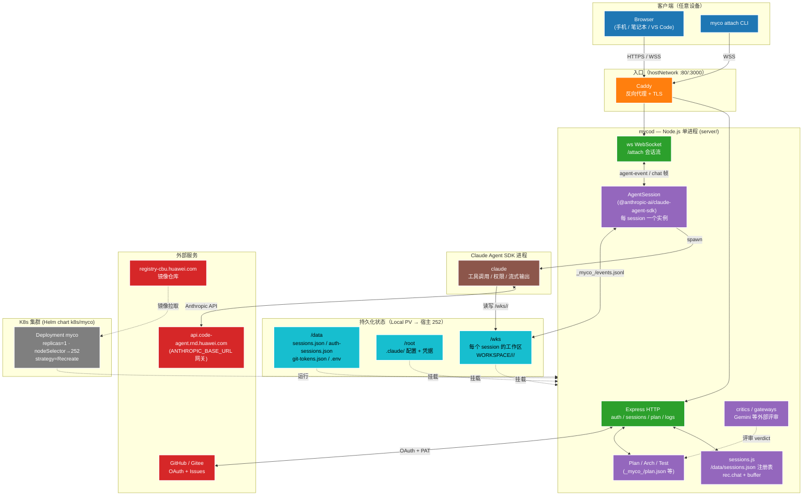

# Myco 整体架构图

```mermaid
flowchart TB
    subgraph client["客户端（任意设备）"]
        Browser["Browser<br/>(手机 / 笔记本 / VS Code)"]
        CLI["myco attach CLI"]
    end

    subgraph ingress["入口（hostNetwork :80/:3000）"]
        Caddy["Caddy<br/>反向代理 + TLS"]
    end

    subgraph server["mycod — Node.js 单进程 (server/)"]
        HTTP["Express HTTP<br/>auth / sessions / plan / logs"]
        WS["ws WebSocket<br/>/attach 会话流"]
        AgentSession["AgentSession<br/>(@anthropic-ai/claude-agent-sdk)<br/>每 session 一个实例"]
        Sessions["sessions.js<br/>/data/sessions.json 注册表<br/>rec.chat + buffer"]
        Plan["Plan / Arch / Test<br/>(_myco_/plan.json 等)"]
        Critic["critics / gateways<br/>Gemini 等外部评审"]
    end

    subgraph sdk["Claude Agent SDK 进程"]
        Claude["claude<br/>工具调用 / 权限 / 流式输出"]
    end

    subgraph ext["外部服务"]
        Anthropic["api.code-agent.rnd.huawei.com<br/>(ANTHROPIC_BASE_URL 网关)"]
        GitHub["GitHub / Gitee<br/>OAuth + Issues"]
        Reg["registry-cbu.huawei.com<br/>镜像仓库"]
    end

    subgraph state["持久化状态（Local PV → 宿主 252）"]
        DataPV["/data<br/>sessions.json / auth-sessions.json<br/>git-tokens.json / .env"]
        HomePV["/root<br/>.claude/ 配置 + 凭据"]
        WksPV["/wks<br/>每个 session 的工作区<br/>WORKSPACE/<user>/<session-id>/"]
    end

    subgraph cluster["K8s 集群 (Helm chart k8s/myco)"]
        Deploy["Deployment myco<br/>replicas=1 · nodeSelector→252<br/>strategy=Recreate"]
    end

    Browser -->|"HTTPS / WSS"| Caddy
    CLI -->|"WSS"| Caddy
    Caddy --> HTTP
    Caddy --> WS
    HTTP <--> Sessions
    HTTP <--> Plan
    WS <-->|"agent-event / chat 帧"| AgentSession
    AgentSession -->|"spawn"| Claude
    Claude <-->|"Anthropic API"| Anthropic
    Claude -->|"读写 /wks/<session>/"| WksPV
    AgentSession <-->|"_myco_/events.jsonl"| WksPV
    Critic -.->|"评审 verdict"| Plan
    HTTP <-->|"OAuth + PAT"| GitHub
    Deploy -.运行.-> server
    DataPV -.挂载.-> server
    HomePV -.挂载.-> server
    WksPV -.挂载.-> server
    Reg -.镜像拉取.-> Deploy

    style Browser fill:#1f77b4,color:#fff,stroke:#fff,stroke-width:2px
    style CLI fill:#1f77b4,color:#fff,stroke:#fff,stroke-width:2px
    style Caddy fill:#ff7f0e,color:#fff,stroke:#fff,stroke-width:2px
    style HTTP fill:#2ca02c,color:#fff,stroke:#fff,stroke-width:2px
    style WS fill:#2ca02c,color:#fff,stroke:#fff,stroke-width:2px
    style AgentSession fill:#9467bd,color:#fff,stroke:#fff,stroke-width:2px
    style Sessions fill:#9467bd,color:#fff,stroke:#fff,stroke-width:2px
    style Plan fill:#9467bd,color:#fff,stroke:#fff,stroke-width:2px
    style Critic fill:#9467bd,color:#fff,stroke:#fff,stroke-width:2px
    style Claude fill:#8c564b,color:#fff,stroke:#fff,stroke-width:2px
    style Anthropic fill:#d62728,color:#fff,stroke:#fff,stroke-width:2px
    style GitHub fill:#d62728,color:#fff,stroke:#fff,stroke-width:2px
    style Reg fill:#d62728,color:#fff,stroke:#fff,stroke-width:2px
    style DataPV fill:#17becf,color:#000,stroke:#fff,stroke-width:2px
    style HomePV fill:#17becf,color:#000,stroke:#fff,stroke-width:2px
    style WksPV fill:#17becf,color:#000,stroke:#fff,stroke-width:2px
    style Deploy fill:#7f7f7f,color:#fff,stroke:#fff,stroke-width:2px
```
